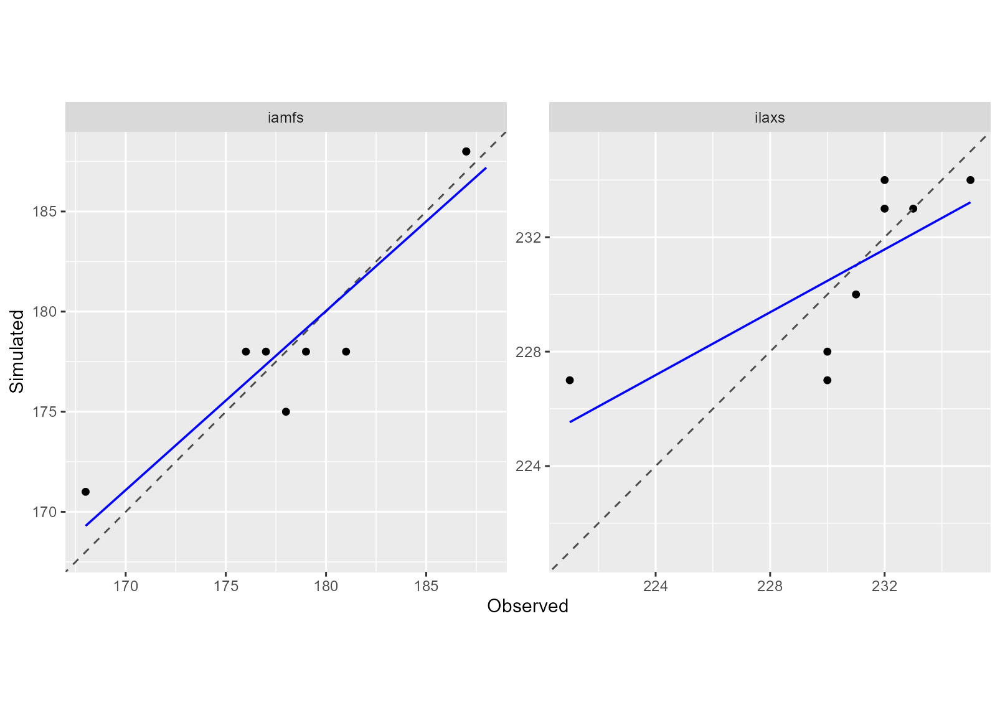

```{r setup, eval=TRUE, include=FALSE}
# Global options
path_to_JavaStics <- params$path_to_JavaStics
```

```{r setup_install_per_package, eval=TRUE, include=FALSE}
# Install and load the needed libraries
# This one is adapted for manual or test cases (one can first install the
# version of the libraries we want to test)
library(SticsOnR)
library(SticsRFiles)
library(CroptimizR)
library(CroPlotR)
library(ggplot2)
library(gridExtra)
library(dplyr)
library(tidyr)
```

## Study Case

This document presents how the AgMIP phase III protocol designed to calibrate phenology of crop models, as described in detail in Wallach et al (2022), can be easily implemented using CroptimizR and CroPlotR packages.

The crop model input data used in this example comes from a maize crop experiment (see description in Wallach et al., 2011). Observed julian days of two phenological stages are simulated on 8 different environments (also called situations in CroptimizR language) from this dataset and then used as synthetic observations, after adding some random errors, to illustrate the calibration procedure.

The STICS crop model is used in this example. Initialization steps required by the use of this model (definition of the `model_options` argument of the `estim_param` function) are hidden in this example for sake of brevity. They are detailed in the vignette (https://SticsRPacks.github.io/CroptimizR/articles/Parameter_estimation_simple_case.html). 

## Plotting the observations

```{r setup_initializations, eval=params$eval_auto_test, message=FALSE, results=FALSE, warning=FALSE, include=FALSE}

# DEFINE THE PATH TO YOUR LOCALLY INSTALLED VERSION OF JAVASTICS
javastics_path <- path_to_JavaStics

# Download the example USMs and define the path to the JavaStics workspace
# (JavaStics XML input files):
data_dir <- file.path(SticsRFiles::download_data(example_dirs = "study_case_1",
                                               stics_version = "V9.0"))

javastics_workspace_path <- file.path(data_dir, "XmlFiles")
```

```{r gen_dirs, eval=params$eval_auto_test, results='hide', message=FALSE, warning=FALSE, include=FALSE}
stics_inputs_path <- file.path(data_dir, "TxtFiles")
dir.create(stics_inputs_path, showWarnings = FALSE)

gen_usms_xml2txt(javastics = javastics_path,
                 workspace = javastics_workspace_path,
  out_dir = stics_inputs_path, verbose = TRUE)
```
```{r eval=params$eval_auto_test, results='hide', message=FALSE, warning=FALSE, include=FALSE}

# Set the model options (see '? stics_wrapper_options' for details)
model_options <- stics_wrapper_options(javastics = javastics_path,
                                     workspace = stics_inputs_path,
                                     parallel = TRUE, cores = 4)

# Run the model on all situations found in stics_inputs_path
sim_res <- stics_wrapper(model_options = model_options,
                  param_values = c(stlevamf = 350, stamflax = 650,
                                 tdmin = 7, tdmax = 26),
                         var = c("iamfs", "ilaxs"))
set.seed(1234)
obs_list <- lapply(sim_res$sim_list, function(x) {
  tmp <- x[nrow(x), c("Date", "iamfs", "ilaxs")]
  row.names(tmp) <- NULL
  tmp[, c("iamfs", "ilaxs")] <- tmp[, c("iamfs", "ilaxs")] +
    round(rnorm(2, mean = 0, sd = 3))
  return(tmp)
})
```

```{r eval=params$eval_manual_vignette, results='hide', message=FALSE, warning=FALSE, include=FALSE}
save(obs_list, file = file.path(params$result_path, "obs_list.Rdata"))
```

```{r eval=params$eval_auto_vignette, results='hide', message=FALSE, warning=FALSE, include=FALSE}
load(file.path("ResultsAgmipPhenology", "obs_list.Rdata"))
```

The observations are provided here in the `obs_list` object, in the format required by CroptimizR, i.e. a named list of data.frame. In this example, the variables corresponding to the two observed stages are called "iamfs" and "ilaxs". They correspond to the julian days (from the beginning of the sowing year) of "end juvenile" and "maximum LAI" stages as defined in the STICS crop model.  

```{r eval=params$eval_auto_vignette, message=FALSE, warning=FALSE}
print(obs_list)
```

Let's plot the observed values:

```{r eval=params$eval_auto_vignette, message=FALSE, warning=FALSE}
obs_df <- dplyr::bind_rows(obs_list) %>% tidyr::pivot_longer(
  cols = c("iamfs", "ilaxs"), names_to = "stage")
ggplot(obs_df, aes(x = stage, y = value)) + geom_boxplot()
```

## Setting information on the parameters to estimate

The whole list of parameters to estimate and their bounds must be provided in 
the `param_info` argument of the `estim_param` function. Note that `-Inf` or `Ìnf`
can be used for, resp., lower and upper bounds. In that case, initial values must 
be provided for the corresponding parameters (see `? estim_param` for more details).

```{r eval=params$eval_auto_test, message=FALSE, warning=FALSE}
param_info <- list(
  lb = c(stlevamf = 100, stamflax = 300, tdmin = 4, stressdev = 0, tdmax = 25),
  ub = c(stlevamf = 500, stamflax = 800, tdmin = 8, stressdev = 1, tdmax = 32))
```

The list of candidate parameters must be provided in the `candidate_param` argument of  
the `estim_param` function. Note that, as prescribed in the protocol, this list 
must be ordered, from those thought to be the most important to those thought to 
be the least important.

In this example, 3 parameters are selected as candidates.

```{r eval=params$eval_auto_test, message=FALSE, warning=FALSE}
candidate_param <- c("tdmin", "stressdev", "tdmax")
```

The parameters not included in `candidate_param` but included in `param_info` will 
be considered as the nearly additive parameters, as defined in the protocol. 
In this example, "stlevamf" and "stamflax" are thus the nearly additive parameters that will be estimated at any step.

## Choosing the default parameters values

Default values for the non-estimated parameters and for the candidate parameters 
can be defined in the `forced_param_values` argument of the `estim_param` function.

```{r eval=params$eval_auto_test, message=FALSE, warning=FALSE}
forced_param_values <- c(tdmin = 5.0, stressdev = 0.2, tdmax = 30.0)
```

## Setting optimization options

Following the AgMIP phase III protocol, different numbers of repetition of the 
minimization are prescribed (`optim_options$nb_rep`): 10 for the estimation of 
the nearly additive parameters and 5 for the estimation of the candidate parameters.

`xtol_rel` and `ftol_rel` are set here to higher values than the default one given 
the relative low precision  of phenology observations and in order to reduce 
computational costs.

```{r eval=params$eval_auto_test, message=FALSE, warning=FALSE}
optim_options <- list(nb_rep = c(10, 5), xtol_rel = 1e-2, ftol_rel = 1e-3)
```

```{r eval=params$eval_auto_test, message=FALSE, warning=FALSE, include=FALSE}
optim_options$out_dir <- data_dir
# path where to store the results (graph and Rdata)
optim_options$ranseed <- 1234
# set random seed so that each execution give the same results
# If you want randomization, don't set it.
```


## Running the optimization

A simple call to the `estim_param` function allows running the whole parameter selection and minimization procedure defined in the AgMIP phase III protocol.

Compared to the simple example presented in (https://SticsRPacks.github.io/CroptimizR/articles/Parameter_estimation_simple_case.html), it is important here to define the `crit_function` argument of the `estim_param` function. 
Indeed, the objective function to minimize in AgMIP phase III protocol is the Ordinary Least Squares, implemented in the function `crit_ols`, which is not the default criterion in `estim_param`.

Note also the use of the arguments `forced_param_values` and `candidate_param`.

By default, the information criterion used for the parameter selection is the BIC, as advised by Wallach et al (2022).
Note however that other criteria can be used (AIC and AICc) using the `info_crit_func` argument.

```{r eval=params$eval_auto_test, message=FALSE, warning=FALSE}
res <- estim_param(obs_list = obs_list,
                crit_function = crit_ols,
                model_function = stics_wrapper,
                model_options = model_options,
                optim_options = optim_options,
                forced_param_values = forced_param_values,
                candidate_param = candidate_param,
                param_info = param_info)
```

At the end of the execution, some information such as the selected step number, the list of selected parameters, their estimated values and some stats about the execution time are printed in the R console: 

```{r eval=FALSE, echo=TRUE}
 
...
# ----------------------
# End of parameter selection process
# ----------------------
#
# Selected step: 2
# Selected parameters: stlevamf,stamflax,tdmin
# Estimated value for stlevamf :  321.18
# Estimated value for stamflax :  589.73
# Estimated value for tdmin :  7.96
#
# A table summarizing the results obtained at the different steps  is stored in  C:/Users/sbuis/AppData/Local/Temp/RtmpwRzZkP/data-master/study_case_1/V9.0/param_selection_steps.csv
# Graphs and detailed results obtained for the different steps can be  found in  C:/Users/sbuis/AppData/Local/Temp/RtmpwRzZkP/data-master/study_case_1/V9.0/results_all_steps/step_# folders.
#
# Average time for the model to simulate all required situations: 4.1 sec elapsed
# Total number of criterion evaluation: 806
# Total time of model simulations: 3293 sec elapsed
# Total time of parameter estimation process: 3314 sec elapsed
# ----------------------
```

The list returned by the `estim_param` function contains the results obtained for the selected step and a data.frame, called `param_selection_steps`, detailing the detailed results of the protocol. The element `param_selection_steps` gives, for each minimization step, the list of candidate parameters, their initial and final values and the values of the Sum of Squares and information criterion. The selected  step is indicated in the last column. It is also stored in csv format for sake of readability (file "param_selection_steps.csv" in `getwd()` folder or in `optim_options$out_dir` folder, if provided to `estim_param`).

```{r eval=params$eval_auto_vignette, message=FALSE, warning=FALSE}
df <- read.csv("ResultsAgmipPhenology/param_selection_steps.csv", sep = ";")
knitr::kable(df)
```

In this example, the selected parameters are "stlevamf", "stamflax" and "tdmin" for which the lowest value of BIC has been obtained.

The list returned by the `estim_param` function is also stored (file "optim_results.Rdata").

The results and diagnostics plots generated by `estim_param` for all the different steps are stored in the subfolder "results_all_steps".


## Generating diagnostics using CroPlotR

First the model wrapper has to be run using the estimated values of the selected 
parameters, and the default values for the others, using its `param_values` argument.

```{r eval=params$eval_auto_vignette, results='hide', message=FALSE, warning=FALSE, include=FALSE}
load(file.path("ResultsAgmipPhenology", "optim_results.Rdata"))
```

```{r eval=params$eval_manual_vignette, message=FALSE, warning=FALSE}
param_values <- c(res$final_values,
                  forced_param_values[setdiff(names(forced_param_values),
                                              names(res$final_values))])
sim_after_optim <- stics_wrapper(param_values = param_values,
                              model_options = model_options,
                              var = c("iamfs", "ilaxs"))
```

Then, the simulated versus observed values can be plotted using the CroPlotR plot function:

```{r eval=FALSE, warning=FALSE, message=FALSE}
plot(sim_after_optim$sim_list, obs = obs_list, type = "scatter")
```

```{r eval=params$eval_manual_vignette, warning=FALSE, message=FALSE, echo=FALSE}
p <- plot(sim_after_optim$sim_list, obs = obs_list, type = "scatter")
save_plot_png(p, optim_options$out_dir)
```

```{r eval=params$eval_auto_vignette, echo=FALSE, message=FALSE, warning=FALSE, out.width = '60%'}

```

MSE and its components can be calcuted for each variable using the CroPlotR summary function: 

```{r eval=FALSE, warning=FALSE, message=FALSE}
summary(sim_after_optim$sim_list, obs = obs_list,
        stats = c("MSE", "Bias2", "SDSD", "LCS"))
```

```{r eval=params$eval_manual_vignette, warning=FALSE, message=FALSE, echo=FALSE}
stats <- summary(sim_after_optim$sim_list, obs = obs_list,
                 stats = c("MSE", "Bias2", "SDSD", "LCS"))
save(stats, file = file.path(params$result_path, "stats.Rdata"))
```

```{r eval=params$eval_auto_vignette, echo=FALSE, message=FALSE, warning=FALSE}
load("ResultsAgmipPhenology/stats.Rdata")
print(stats)
```


```{r move_results, eval=params$eval_manual_vignette, include=FALSE}
# Move the files produced since the temp. folder is removed after Rmd execution
file.copy(file.path(optim_options$out_dir, "param_selection_steps.csv"),
          params$result_path, overwrite = TRUE)
file.copy(file.path(optim_options$out_dir, "param_selection_steps.Rdata"),
          params$result_path, overwrite = TRUE)
file.copy(file.path(optim_options$out_dir, "optim_results.Rdata"),
          params$result_path, overwrite = TRUE)
file.copy(file.path(optim_options$out_dir, "all_situations.png"),
          params$result_path, overwrite = TRUE)
dir.create(file.path(params$result_path, "results_all_steps"))
file.copy(from = file.path(optim_options$out_dir, "results_all_steps"),
        to = file.path(params$result_path, "results_all_steps"),
        recursive = TRUE,
        overwrite = TRUE)
```
