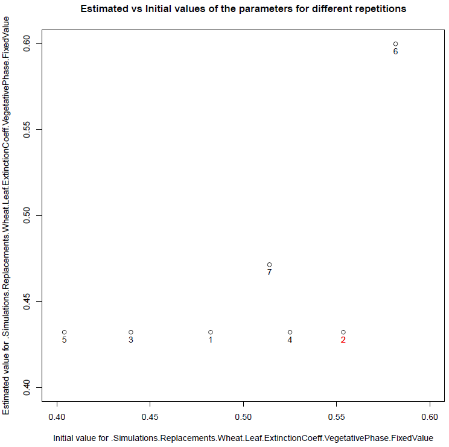
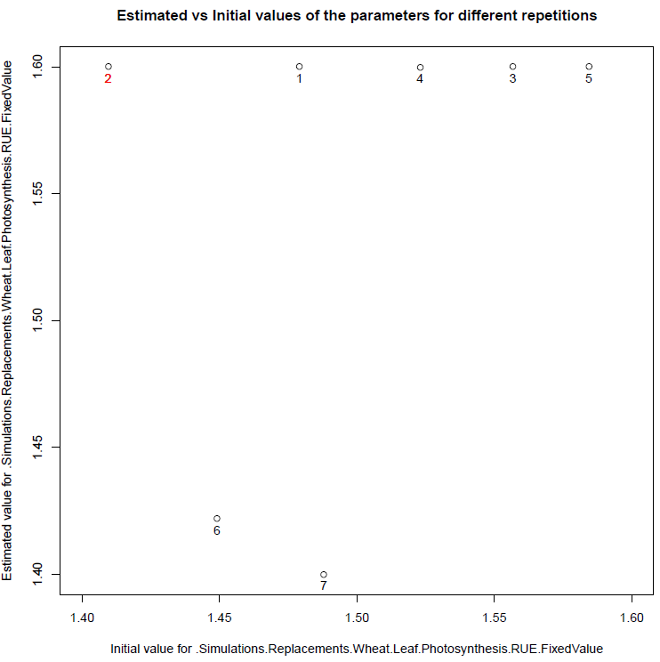
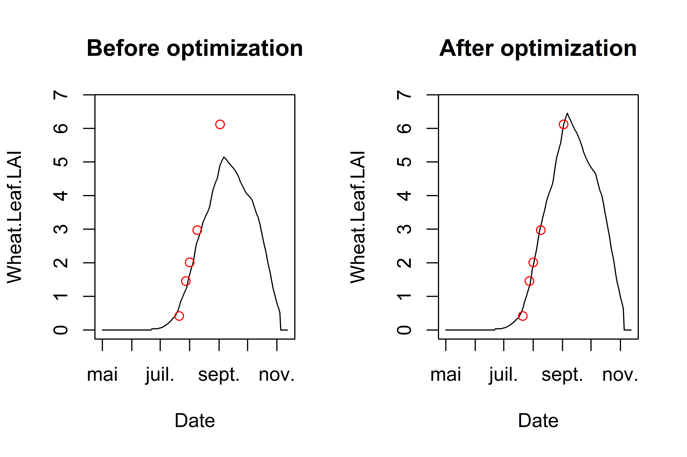

```{r setup, eval=TRUE, include=FALSE}
# Global options
knitr::opts_chunk$set(eval = params$eval_rmd)
```


## Study Case

A simple parameter estimation with a single situation, a single observed variable and 2 estimated parameters, just to illustrate how to use the package with the ApsimX model.

The parameter estimation is performed using the Nelder-Mead simplex method implemented in the `nloptr` package.


## Initialisation step


```{r setup_initializations, message=FALSE, results=FALSE, warning=FALSE}

# Install and load the needed libraries
if(!require("CroptimizR")){
  devtools::install_github("SticsRPacks/CroptimizR@*release")
  library("CroptimizR")
}
if(!require("CroPlotR")){
  devtools::install_github("SticsRPacks/CroPlotR@*release")
  library("CroPlotR")
}
if(!require("ApsimOnR")){
  devtools::install_github("hol430/ApsimOnR")
  library("ApsimOnR")
}
if(!require("dplyr")){
  install.packages("dplyr",repos="http://cran.irsn.fr")
  library("dplyr")
}
if(!require("ggplot2")){
  install.packages("ggplot2",repos="http://cran.irsn.fr")
  library("ggplot2")
}
if(!require("gridExtra")){
  install.packages("gridExtra",repos="http://cran.irsn.fr")
  library("gridExtra")
}

# DEFINE THE PATH TO THE LOCALLY INSTALLED VERSION OF APSIM (should be something like C:/path/to/apsimx/bin/Models.exe on windows, and /usr/local/bin/Models on linux)
apsimx_path <- "D:\\Home\\sbuis\\Documents\\OUTILS-INFORMATIQUE\\APSIM2021.01.20.5937\\Bin\\Models.exe"
```


## Set the list of situations and variables to consider in this example


```{r message=FALSE, warning=FALSE}

sit_name="GattonRowSpacingRowSpace25cm"  # among "GattonRowSpacingRowSpace25cm", "GattonRowSpacingRowSpace50cm","GattonRowSpacingRowSpaceN0"

var_name = c("Wheat.Leaf.LAI") # or "Wheat.AboveGround.Wt"
```


## Run the model before optimization for a prior evaluation

In this case, the argument `param_values` of the wrapper is not set: the values of the model input parameters are all read in the model input files.


```{r results='hide', message=FALSE, warning=FALSE}


# Set the model options (see '? apsimx_wrapper_options' for details)
files_path <- system.file(file.path("extdata","apsimx_files"),package = "ApsimOnR")
apsimx_file <- file.path(files_path, "template.apsimx")

# Setting met files path
met_files_path <- files_path

# Setting observed data files path
obs_files_path <- files_path

# Setting sqlite db tables names
predicted_table_name <- "DailyReport"
observed_table_name <- "Observed"

model_options=apsimx_wrapper_options(apsimx_path = apsimx_path,
                                     apsimx_file =  apsimx_file,
                                     variable_names = var_name,
                                     predicted_table_name = predicted_table_name,
                                     met_files_path = met_files_path,
                                     observed_table_name = observed_table_name,
                                     obs_files_path = obs_files_path)

# Run the model (on all situations found in the apsimx_file)
sim_before_optim=apsimx_wrapper(model_options=model_options)
```


## Read and select the corresponding observations

We only keep observations for situation `sit_name` and variable `var_name` (`obs_list` defines the list of situations and variables that will be used in the parameter estimation process).


```{r message=FALSE, warning=FALSE}
# At the moment, observed data are read from the db file after the first simulation ran before optimization.
#But they may be loaded using the original xlsx data file (from the files_path)

obs_list <- read_apsimx_output(sim_before_optim$db_file_name,
                               model_options$observed_table_name,
                               model_options$variable_names,
                               names(sim_before_optim$sim_list))
obs_list=filter_obs(obs_list, situation=sit_name,include=TRUE)
```


## Set information on the parameters to estimate

**`param_info` must contain information about the parameters that will be estimated in the parameter estimation process from the situations, variables and dates defined in `obs_list`**.

It must include the definition of their upper and lower bounds (-Inf and Inf can be used). This will determine the list of estimated parameters.

Initial values for the minimization can also be provided in `param_info` (see `? estim_param`).


```{r message=FALSE, warning=FALSE}
# 2 parameters here: ExtinctionCoeff and RUE, of bounds [0.4,0.6] and [1.4,1.6]
param_info <-
  list(lb=c(.Simulations.Replacements.Wheat.Leaf.ExtinctionCoeff.VegetativePhase.FixedValue=0.4,
            .Simulations.Replacements.Wheat.Leaf.Photosynthesis.RUE.FixedValue=1.4),
       ub=c(.Simulations.Replacements.Wheat.Leaf.ExtinctionCoeff.VegetativePhase.FixedValue=0.6,
            .Simulations.Replacements.Wheat.Leaf.Photosynthesis.RUE.FixedValue=1.6))
```


## Set options for the parameter estimation method

`optim_options` should contain the options of the parameter estimation method.
Here we defined a few options for the simplex method of the `nloptr` package (default method in estim_param).
The full set of options for the simplex method can be found in the [vignette of nloptr package](https://cran.r-project.org/web/packages/nloptr/vignettes/nloptr.pdf).

The number of repetitions `nb_rep` is advised to be set at least to 5, while 10 is a reasonable maximum value.
`maxeval` should be used to stop the minimization only if results have to be produced within a given duration, otherwise set it to a high value so that the minimization stops when the criterion based on the relative tolerance `xtol_rel` is satisfied.


```{r message=FALSE, warning=FALSE}

optim_options=list()
optim_options$nb_rep <- 7 # Number of repetitions of the minimization
                          # (each time starting with different initial
                          # values for the estimated parameters)
optim_options$maxeval <- 500 # Maximum number of evaluations of the
                             # minimized criteria
optim_options$xtol_rel <- 1e-03 # Tolerance criterion between two iterations
                                # (threshold for the relative difference of
                                # parameter values between the 2 previous
                                # iterations)

optim_options$out_dir <- getwd() # path where to store the results (graph and Rdata)

optim_options$ranseed <- 1234 # set random seed so that each execution give the same results
                              # If you want randomization, don't set it.
```


## Run the optimization

The Nelder-Mead simplex is the default method => no need to set the
optim_method argument if you want to use it. The list of available methods is detailed [here](https://sticsrpacks.github.io/CroptimizR/articles/Available_parameter_estimation_algorithms.html).
Same for crit_function: a value is set by default (`crit_log_cwss`, see `? crit_log_cwss` or [here](https://sticsrpacks.github.io/CroptimizR/reference/ls_criteria.html) for more details and list of available criteria). Others will be proposed in next versions of CroptimizR. The user can implement and give in argument its own criterion (see inputs and outputs required in the `crit_log_cwss` function).


```{r message=FALSE, warning=FALSE}

res=estim_param(obs_list=obs_list,
                            model_function=apsimx_wrapper,
                            model_options=model_options,
                            optim_options=optim_options,
                            param_info=param_info)
```

The estimated values of the parameters are the following:

```{r eval=FALSE, echo=TRUE}
res$final_values
```

```{r echo=FALSE, eval=params$eval_auto_vignette, warning=FALSE}
load(file.path("ResultsSimpleCaseApsim","optim_results.Rdata"))
res$final_values
```


Complementary graphs and data are stored in the folder which path is given in `optim_options$out_dir`. Among them, the `EstimatedVSinit.pdf` file contains the following figures:


```{r eval=TRUE, echo=FALSE, out.width = '45%'}




```

Figure 1:  plots of estimated vs initial values of parameters *ExtinctionCoeff* and *RUE*. Numbers represent the repetition number of the minimization and the size of the bubbles the final value of the minimized criterion. The number in white, 2 in this case, is the minimization that lead to the minimal value of the criterion among all repetitions. In this case, minimizations converge towards different values for the parameters (3 for *ExtinctionCoeff* and 2 for *RUE*), which indicates the presence of local minima. Values of *RUE* are very close to the upper bound value. In realistic calibration cases this may indicate the presence of a large error in the observation values or in the simulated output values (this simple case with only one situation does not allow to derive such conclusion).


## Run the model after optimization

In this case, the `param_values` argument is set so that estimated values of the parameters overwrite the values defined in the model input file ('.apsimx`).


```{r results='hide', message=FALSE, warning=FALSE}

sim_after_optim=apsimx_wrapper(param_values=res$final_values,
                               model_options=model_options)
```


## Plot the results

Here we use the [CroPlotR](https://github.com/SticsRPacks/CroPlotR) package for comparing simulations and observations. As CroptimizR, CroPlotR can be used with any crop model.

```{r results='hide', message=FALSE, warning=FALSE}
p <- plot(sim_before_optim$sim_list, obs=obs_list, select_dyn = c("common"))
p1 <- p[[sit_name]] + labs(title="Before Optimization")

p <- plot(sim_after_optim$sim_list, obs=obs_list, select_dyn = c("common"))
p2 <- p[[sit_name]] + labs(title="After Optimization") +
  ylim(NA,ggplot_build(p1)$layout$panel_params[[1]]$y.range[2])

p <- grid.arrange(grobs=list(p1,p2), nrow=1, ncol=2)
# Save the graph
ggsave(file.path(optim_options$out_dir,
                 paste0("sim_obs_plots",".png")), plot=p)
```


this gives:

```{r eval=TRUE, echo=FALSE, message=FALSE, out.width = '80%', fig.cap="Figure 2: plots of simulated and observed target variable before and after optimization. The gap between simulated and observed values has been drastically reduced: the minimizer has done its job!"}

```


```{r move_results, include=FALSE}
# Move the files produced since the temp. folder is removed after Rmd execution
file.copy(file.path(optim_options$out_dir,"EstimatedVSinit.pdf"),params$result_path, overwrite = TRUE)
file.copy(file.path(optim_options$out_dir,"optim_results.Rdata"),params$result_path, overwrite = TRUE)
file.copy(file.path(optim_options$out_dir,"sim_obs_plots.png"),params$result_path, overwrite = TRUE)
```
