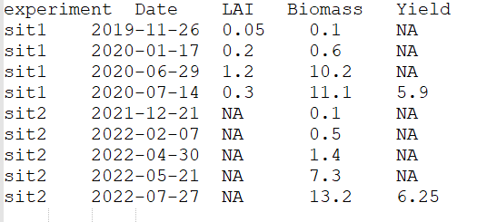

```{r, include = FALSE}
knitr::opts_chunk$set(
  collapse = TRUE,
  comment = "#>"
)
```

## Introduction

The goal of CroptimizR is to provide facilities for performing parameter estimation 
of crop models from observations of their simulated variables.

This article presents the main concepts and features of the package.

## Concepts

### Parameter estimation

Parameters of Crop Models are sometimes difficult or impossible to measure with 
experiments or to set from bibliography. In that case, their values are often adjusted 
by comparing the resulting simulated model outputs to a set of corresponding observed values 
measured on experimental fields. This process is often called **model calibration**.
Several studies have shown that the way calibration is performed largely impact 
crop model simulation results (see e.g. Confalonieri et al., 2016; Guillaume et al., 2011; 
He et al., 2017; Wallach et al., 2021a; 
Wallach et al., 2021b).

Mathematical parameter estimation techniques are particularly useful in this case 
since they can automatically explore the potential values of several parameters and 
take into account observations of several variables. They typically consists in 
finding the parameters values which minimize a distance between the results of 
model simulations and the corresponding observations.

### Specific features and interest of CroptimizR

A lot of packages propose implementations of parameter estimation methods. None of 
them are however particularly adapted to crop models and they do not share a standard 
format for coupling models to the methods they implements. As a result, crop models 
users may be lost in the multiplicity of packages and methods proposed and must 
provide a significant effort to test different packages.

The objective of CroptimizR is to provide ad hoc tools and methods to calibrate 
crop models from observations of their simulated variables and to easily compare 
different types of methods on different crop models.

For that, it offers a generic framework for linking crop models with up-to-date 
and ad-hoc parameter estimation algorithms implemented in external packages. It 
proposes a standard interface for crop models, a set of adapted calibration procedures
and goodness-of-fit criteria as well as additional specific functionalities. 

In particular, calibration procedures defined in the [AgMIP Calibration project](https://agmip.org/crop-model-calibration-3/) are implemented in CroptimizR 
(see for example [here](LIEN VERS VIGNETTE AGMIP) an application of phenology 
estimation following AgMIP-calibration phase III protocol). Actually CroptimizR 
has been used by more than a dozen of crop model groups in AgMIP-calibration phase 
III exercise (see Wallach et al, 2022).

Other advanced functionalities include among others: 

  * Fine tuning of the selected optimization algorithm through specific options, 
  * specification of initial values and constraints on the estimated parameters 
  (bounds and/or freely-defined constraints such as inequalities between parameters),  
  * dynamic execution of user-defined transformations for observed and/or simulated 
  values of model output variables in case they would not be directly comparable,  
  * forcing of crop model parameters to given values while estimating others,  
  * modulating the level of additional information in output of the parameter 
  estimation process (from nothing to all simulated results for each parameter values 
  tested),  
  * … 

More details about the list of available methods and goodness-of-fit criteria can be found 
[here](https://SticsRPacks.github.io/CroptimizR/articles/Available_parameter_estimation_algorithms.html) 

### Principle 

Basically, users are asked to provide:

   * an R wrapper function for the crop model to use and the associated options, 
   * a list of observed values of model output variables, 
   * a list of parameters to estimate. 
   
The parameter estimation process automatically runs the chosen crop model on a set of observed situations by forcing the estimated parameters to the values proposed by the selected algorithm. It will then compute the selected goodness-of-fit criterion using the simulated values and corresponding observations of the model output variables.
   
In output, CroptimizR generates specific statistics and graphs depending on the 
family of the algorithm used (see section “Examples”). 

### Model wrappers

CroptimizR has been designed to be generic, that is to be used with any crop model for which an R wrapper can be provided.

An R wrapper is basically an R function able to run model simulations for prescribed values of some of its input parameters and to return the values of its simulated outputs. This wrapper must have a specific interface, i.e. a given list and shape of input arguments and returned values. Detailed guidelines on how to implement a crop model wrapper as well as different examples of wrappers are provided in the CroptimizR documentation (see https://sticsrpacks.github.io/CroptimizR/articles/Designing_a_model_wrapper.html). A generic function for testing that model wrappers behave as expected and return values in an adequate form is provided in the package. 

Note that the use of an R wrapper does not imply that the crop model is implemented in R language. Interfaces between R and many computer languages exist (see e.g. the [reticulate package](https://cran.r-project.org/web/packages/reticulate/index.html) for Python, (https://www.r-bloggers.com/2014/04/fortran-and-r-speed-things-up/ ) for Fortran, (**REF**)https://www.r-bloggers.com/2014/02/three-ways-to-call-cc-from-r/) for C and C++ ...). They allow calling functions implemented in these languages within R functions. In case the crop model is available as an executable binary file, a basic solution for running model simulations from an R wrapper consists in using the base R function `system2`  (see `? system2()` within R). 

Simulated results provided by crop model wrappers compatible with CroptimizR can be directly used in CroPlotR functions as illustrated in section [Model Evaluation](#model-evaluation). 

Model wrappers for CroptimizR have been developed for more than a dozen of crop models among which STICS (see packages [SticsOnR](https://sticsrpacks.github.io/SticsOnR/) and [SticsRFiles](https://sticsrpacks.github.io/SticsRFiles/)), ApsimX (https://github.com/APSIMInitiative/ApsimOnR), DSSAT 4.7 (CERES and CropSim), SiriusQUality2, HERMES, ... 

### Observations

Observed values of model output variables have to be provided under the shape of a named list of data frames. For each observed situation (typically a plot-year-treatment) the corresponding data frame must include one column named Date with the dates of the different observations (in Date or POSIXct format) and one column per observed variables, with either the measured values or NA if the variable is not observed at the given date. 

Let's consider the observations are, as often, available under the shape of a text file as in the following example.

{#id .class width=50% height=50%}
In this example, observations are available for two situations, called here "sit1" and "sit2", three variables for situation "sit1" ("LAI", "Biomass" and "Yield") and two for "sit2" ("Biomass" and "Yield"). Observations of "Yield" where only provided for the last date. 

The following code allows reading this file and store the observations in R in the expected format:

```{r}
obs_df <- read.table("GettingStarted/obs.csv", header = TRUE)
obs_df$Date <- as.Date(obs_df$Date)
obs_list <- split(obs_df[-1], obs_df$experiment)

print(obs_list)
```

## Examples 

* A simple introductory example of model calibration using the Stics model is given in this [vignette](https://SticsRPacks.github.io/CroptimizR/articles/Parameter_estimation_simple_case.html).

* A more complex one with simultaneous estimation of specific and varietal plant parameters is given  [here](https://SticsRPacks.github.io/CroptimizR/articles/Parameter_estimation_Specific_and_Varietal.html).

* An example using the ApsimX model is detailed [here](https://SticsRPacks.github.io/CroptimizR/articles/ApsimX_parameter_estimation_simple_case.html).

* An example using the DREAM-zs Bayesian algorithm is detailed [here](https://SticsRPacks.github.io/CroptimizR/articles/Parameter_estimation_DREAM.html).

* An example of application of the AgMIP phase III protocol, designed to calibrate phenology of crop models, as described in detail in Wallach et al (2022), is given [here](https://SticsRPacks.github.io/CroptimizR/articles/AgMIP_Calibration_Phenology_protocol.html).

See [here](https://sticsrpacks.github.io/CroptimizR/reference/estim_param.html) for a detailed description of the input and output arguments of the estim_param function (or type `? estim_param` in an R console after having installed and loaded the CroptimizR package).

### Model evaluation

Model results are classically evaluated by comparison to corresponding observations using graphs and statistical criteria. We designed a specific package for this task: [CroPlotR](https://sticsrpacks.github.io/CroPlotR/).

CroPlotR use the same data format for observaitons and simulations than CroptimizR: the results given by model wrappers and observation list adapted to CroptimizR are thus directly compatible with CroPlotR.

## References

Confalonieri, R., Orlando, F., Paleari, L., Stella, T., Gilardelli, C., Movedi, E., Pagani, V., Cappelli, G., Vertemara, A., Alberti, L., Alberti, P., Atanassiu, S., Bonaiti, M., Cappelletti, G., Ceruti, M., Confalonieri, A., Corgatelli, G., Corti, P., Dell’Oro, M., Ghidoni, A., Lamarta, A., Maghini, A., Mambretti, M., Manchia, A., Massoni, G., Mutti, P., Pariani, S., Pasini, D., Pesenti, A., Pizzamiglio, G., Ravasio, A., Rea, A., Santorsola, D., Serafini, G., Slavazza, M., Acutis, M., 2016. Uncertainty in crop model predictions: What is the role of users? Environ. Model. Softw. 81, 165–173. https://doi.org/10.1016/J.ENVSOFT.2016.04.009 

Guillaume, S., Bergez, J.E., Wallach, D., Justes, E., 2011. Methodological comparison of calibration procedures for durum wheat parameters in the STICS model. Eur. J. Agron. 35, 115–126. https://doi.org/10.1016/J.EJA.2011.05.003 

He, D., Wang, E., Wang, J., Robertson, M.J., 2017. Data requirement for effective calibration of process-based crop models. Agric. For. Meteorol. 234–235, 136–148. https://doi.org/10.1016/J.AGRFORMET.2016.12.015 

Wallach, D., Palosuo, T., Thorburn, P., Gourdain, E., Asseng, S., Basso, B., Buis, S., Crout, N., Dibari, C., Dumont, B., Ferrise, R., Gaiser, T., Garcia, C., Gayler, S., Ghahramani, A., Hochman, Z., Hoek, S., Hoogenboom, G., Horan, H., Huang, M., Jabloun, M., Jing, Q., Justes, E., Kersebaum, K.C., Klosterhalfen, A., Launay, M., Luo, Q., Maestrini, B., Mielenz, H., Moriondo, M., Nariman Zadeh, H., Olesen, J.E., Poyda, A., Priesack, E., Pullens, J.W.M., Qian, B., Schütze, N., Shelia, V., Souissi, A., Specka, X., Srivastava, A.K., Stella, T., Streck, T., Trombi, G., Wallor, E., Wang, J., Weber, T.K.D., Weihermüller, L., de Wit, A., Wöhling, T., Xiao, L., Zhao, C., Zhu, Y., Seidel, S.J., 2021a. How well do crop modeling groups predict wheat phenology, given calibration data from the target population? Eur. J. Agron. 124, 126195. https://doi.org/10.1016/J.EJA.2020.126195 

Wallach, D., Palosuo, T., Thorburn, P., Hochman, Z., Andrianasolo, F., Asseng, S., Basso, B., Buis, S., Crout, N., Dumont, B., Ferrise, R., Gaiser, T., Gayler, S., Hiremath, S., Hoek, S., Horan, H., Hoogenboom, G., Huang, M., Jabloun, M., Jansson, P.E., Jing, Q., Justes, E., Kersebaum, K.C., Launay, M., Lewan, E., Luo, Q., Maestrini, B., Moriondo, M., Olesen, J.E., Padovan, G., Poyda, A., Priesack, E., Pullens, J.W.M., Qian, B., Schütze, N., Shelia, V., Souissi, A., Specka, X., Kumar Srivastava, A., Stella, T., Streck, T., Trombi, G., Wallor, E., Wang, J., Weber, T.K.D., Weihermüller, L., de Wit, A., Wöhling, T., Xiao, L., Zhao, C., Zhu, Y., Seidel, S.J., 2021b. Multi-model evaluation of phenology prediction for wheat in Australia. Agric. For. Meteorol. 298–299, 108289. https://doi.org/10.1016/J.AGRFORMET.2020.108289 

Wallach, D., Palosuo, T., Thorburn, P., Mielenz, H., Buis, S., Hochman, Z., Gourdain, E., Andrianasolo, F., Dumont, B., Ferrise, R., Gaiser, T., Garcia, C., Gayler, S., Hiremath, S., Horan, H., Hoogenboom, G., Jansson, P.-E., Jing, Q., Justes, E., Kersebaum, K.-C., Launay, M., Lewan, E., Mequanint, F., Moriondo, M., Nendel, C., Padovan, G., Qian, B., Schütze, N., Seserman, D.-M., Shelia, V., Souissi, A., Specka, X., Srivastava, A.K., Trombi, G., Weber, T.K.D., Weihermüller, L., Wöhling, T., Seidel, S.J., 2022. Calibration of crop phenology models: Going beyond recommendations. bioRxiv 2022.06.08.495355

