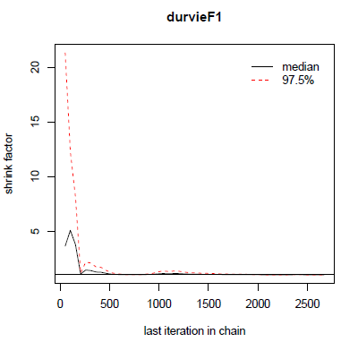
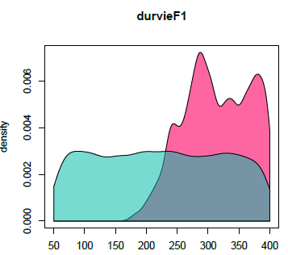
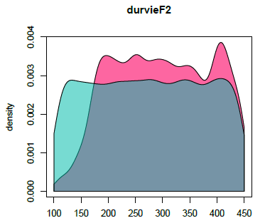

```{r init, include=FALSE}
params <-
list(eval_rmd = FALSE)
```


---
title: "Parameter estimation with the DREAM-zs algorithm"
output: rmarkdown::html_vignette
author:
- name: "Samuel Buis"
affiliation: "INRAE - EMMAH"
date: "`r Sys.Date()`"
vignette: >
  %\VignetteIndexEntry{Parameter estimation with DREAM-zs}
  %\VignetteEngine{knitr::rmarkdown}
  %\VignetteEncoding{UTF-8}
params:
  eval_rmd: FALSE
---


```{r setup, eval=TRUE, include=FALSE}
# Global options
knitr::opts_chunk$set(eval = params$eval_rmd)
```


## Study Case

This document presents an example of use of the DREAM-zs algorithm with the Stics crop model.

The study case is the same as the specific and varietal parameters estimation presented in this [vignette](https://sticsrpacks.github.io/CroptimizR/articles/Parameter_estimation_Specific_and_Varietal.html).

**WARNING: The interface of the DREAM method in CroptimizR is still under development. Results should be taken with care.** 

## Initialisation step

This part is not shown here, it is the same as this of the [introductory example](https://sticsrpacks.github.io/CroptimizR/articles/Parameter_estimation_simple_case.html). 


```{r setup_initializations,  echo=FALSE, message=FALSE, results=FALSE, warning=FALSE}
knitr::opts_chunk$set(echo = TRUE)
# Install and load the needed libraries
devtools::install_github("SticsRPacks/SticsRPacks")
library("SticsRPacks")

# Download the example USMs:
data_dir= normalizePath(tempdir(), winslash = "/", mustWork = FALSE)
data_dir_zip= normalizePath(file.path(data_dir,"master.zip"), winslash = "/", mustWork = FALSE)
download.file("https://github.com/SticsRPacks/data/archive/master.zip", data_dir_zip)
unzip(data_dir_zip, exdir = data_dir)
unlink(data_dir_zip)
data_dir= file.path(normalizePath(list.dirs(data_dir)[2], winslash = "/"),"study_case_1","V9.0")
# NB: all examples are now in data_dir
# Define the path to the local version of JavaStics 
javastics_path=file.path(path_to_JavaStics,"JavaSTICS-1.41-stics-9.0")
stics_path=file.path(javastics_path,"bin/stics_modulo.exe")
```


## Read and select the corresponding observations

This part is not shown here, it is the same as this of the [specific and varietal parameters estimation vignette](https://sticsrpacks.github.io/CroptimizR/articles/Parameter_estimation_Specific_and_Varietal.html).


```{r echo=FALSE, message=FALSE, warning=FALSE}
# Read observation files
obs_list=get_obs(file.path(data_dir,"XmlFiles"))
obs_list=filter_obs(obs_list, var_names=c("lai_n"),include=TRUE)
```


## Set options for the DREAM method

The main basic options are set here. The reader can refer to `? DREAMzs` (see doc for input argument `settings`) for documentation on more advanced ones. Note that `startValue` can also be used to provide initial values for the Markov Chains (in that case, it must be a matrix having as many lines as desired number of Markov Chains and a number of columns equivalent to the number of estimated parameters, ordered in the same way as `param_info$lb` and `param_info$ub`).


```{r message=FALSE, warning=FALSE}
optim_options=list() 
optim_options$iterations <- 10000 # Total number of iterations 
                                  # (=> optim_options$iterations/optim_options$startValue 
                                  # iterations per chain)
optim_options$startValue <- 3 # Number of markov chains
optim_options$path_results <- data_dir # path where to store the results (graph and Rdata)
optim_options$ranseed <- 1234 # seed for random numbers
```


## Run the parameter estimation

In this case, the parameter estimation algorithm (`optim_method`argument) and the criterion function (`crit_function` argument) must be set in input of `estim_param` function.

The list of available criteria for Bayesian methods is given by `? likelihoods`

The `param_info` argument has the same content as in the [specific and varietal parameters estimation vignette](https://sticsrpacks.github.io/CroptimizR/articles/Parameter_estimation_Specific_and_Varietal.html).

**For the moment, only uniform distributions of bounds `param_info$lb` and `param_info$ub` can be used. Other type of distributions will be provided in next versions.** 


```{r results='hide', message=FALSE, warning=FALSE}
optim_results=estim_param(obs_list=obs_list,
                          crit_function=likelihood_log_ciidn,
                          model_function=stics_wrapper,
                          model_options=model_options,
                          optim_options=optim_options,
                          optim_method="BayesianTools.dreamzs",
                          param_info=param_info)
```


The results printed in output on the R console are the following:


```{r eval=FALSE, echo=TRUE}
## ## # # # # # # # # # # # # # # # # # # # # # # # # #
## ## ## MCMC chain summary ##
## ## # # # # # # # # # # # # # # # # # # # # # # # # #
## ##
## ## # MCMC sampler:  DREAMzs
## ## # Nr. Chains:  3
## ## # Iterations per chain:  2669
## ## # Rejection rate:  0.878
## ## # Effective sample size:  423
## ## # Runtime:  54194.02  sec.
## ##
## ## # Parameters
## ##            psf     MAP    2.5%  median   97.5%
## ## dlaimax  1.045   0.001   0.001   0.001   0.001
## ## durvieF1 1.000 289.864 213.438 311.226 398.462
## ## durvieF2 1.009 208.487 147.158 298.312 443.323
## ##
## ## ## DIC:  442.256
## ## ## Convergence
## ##  Gelman Rubin multivariate psrf:
## ##
## ## ## Correlations
## ##          dlaimax durvieF1 durvieF2
## ## dlaimax    1.000   -0.074   -0.059
## ## durvieF1  -0.074    1.000   -0.029
## ## durvieF2  -0.059   -0.029    1.000
```


The rejection rate is the rate of rejection of proposed values. According to (Vrugt, 2016), a value between 0.7 and 0.85 is usually indicative of good performance of a MCMC simulation method.

Effective sample size should be here the number of different values per chain for the parameter vector in the posterior sample.

Under section "parameters" are given statistics on the posterior sample.
MAP means Maximum A Posteriori. It is the values of the parameters among the posterior sample that lead to the maximal value of the posterior density. 

DIC is the Deviance information criterion. It is a commonly applied method to summarize the fit of an MCMC chain. More details about it can be found in the [vignette of the BayesianTools package](https://cran.r-project.org/web/packages/BayesianTools/vignettes/BayesianTools.html).

The output value of `estim_param` contains:
* `statistics`, `quantiles` and `MAP`: statistics on the posterior sample,
* `post_sample`, a sample of the posterior distribution (excluding the burnin phase),
* `out`: the list returned by the package BayesianTools.

It is stored with complementary graphs in the `optim_options$path_results` folder. 

Among these graphs, gelmanDiagPlots.pdf plots the evolution of the Gelman diagnostic. According to (Vrugt, 2016) the algorithm is considered to have converged to the posterior distribution when all the values of this diagnostic are inferior to 1.2. In theory the sample of the posterior distribution should thus be taken only after this (WARNING: it is not the case here, neither in BayesianTools, this should be improved).

In this case, we obtain:


```{r eval=TRUE, echo=FALSE, out.width = '45%'}



```

Figure 1: Gelman diagnostic.


marginalPlots.pdf shows estimation of the prior (blue) and posterior (pink) densities:


```{r eval=TRUE, echo=FALSE, out.width = '45%'}



```

Figure 2: Prior and posterior densities.

correlationPlots.pdf gives information about the correlation between parameters:


```{r eval=TRUE, echo=FALSE, out.width = '75%'}

```

Figure 3: Correlation plot.


## Launch a new estimation starting from previous results 

In case one wants to increase the number of iterations, because the algorithm has not yet converged or the posterior sample is considered to small, there is a possibility to re-launch the method from the point is has stopped using the `PreviousResults` option:


```{r results='hide', message=FALSE, warning=FALSE}
optim_options$PreviousResults=optim_results$out
optim_options$iterations <- 1000 # Total number of new iterations
optim_results=estim_param(obs_list=obs_list,
                          crit_function=likelihood_log_ciidn,
                          model_function=stics_wrapper,
                          model_options=model_options,
                          optim_options=optim_options,
                          optim_method="BayesianTools.dreamzs",
                          param_info=param_info)
```

