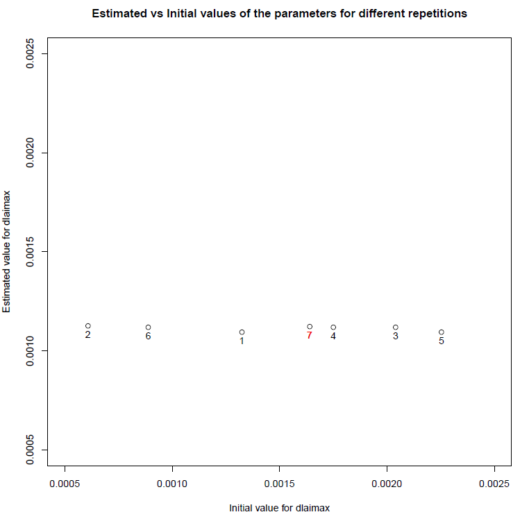
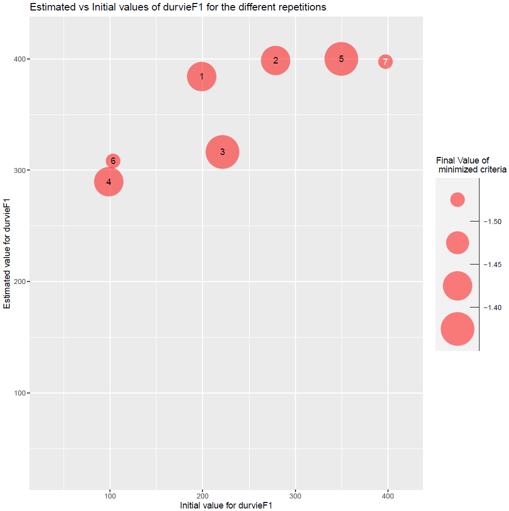
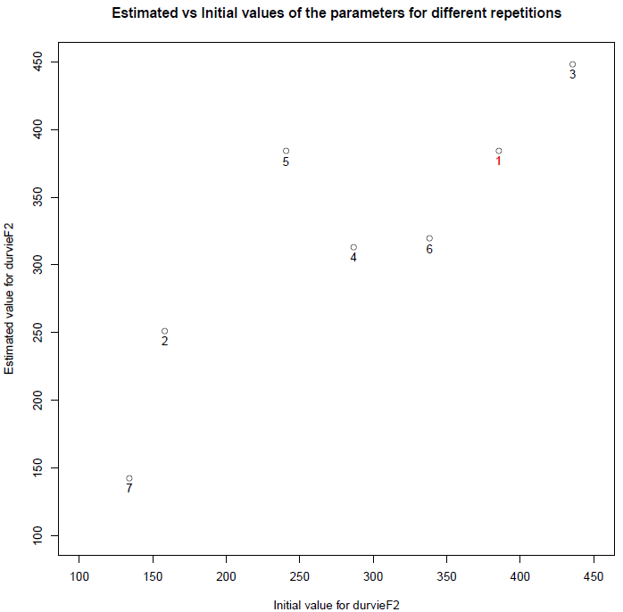
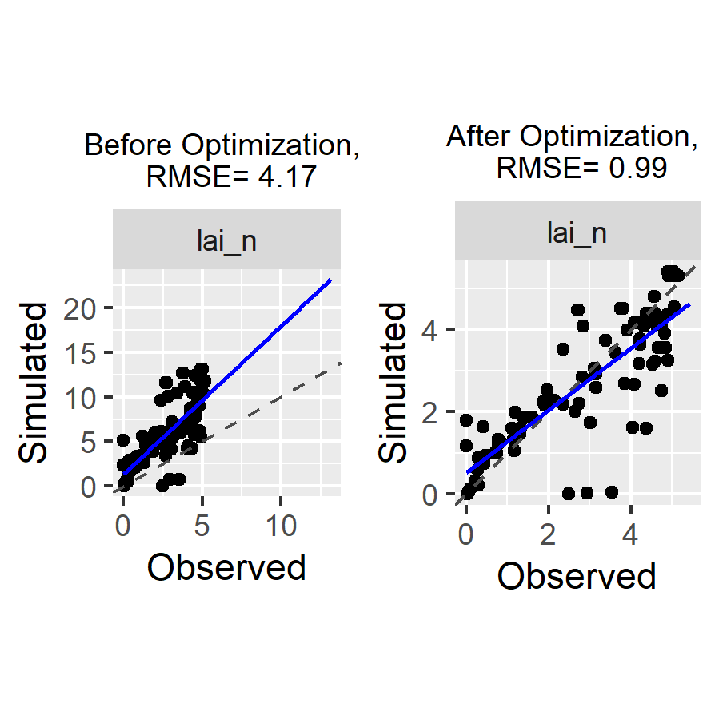

```{r init, include=FALSE}
params <-
list(eval_rmd = FALSE)
```

---
title: "Parameter estimation with the Stics crop Model: a case with specific and varietal parameters"
output: rmarkdown::html_vignette
author:
- name: "Samuel Buis"
affiliation: "INRA - EMMAH"
date: "`r Sys.Date()`"
vignette: >
  %\VignetteIndexEntry{Parameter estimation with Stics}
  %\VignetteEngine{knitr::rmarkdown}
  %\VignetteEncoding{UTF-8}
params:
  eval_rmd: FALSE
---


```{r setup, eval=TRUE, include=FALSE}
# Global options
knitr::opts_chunk$set(eval = params$eval_rmd)
```


## Study Case

This document presents an example of a simultaneous estimation of one specific and one varietal parameter on a multi-varietal dataset using the Stics model, while a simpler introductory example is presented in this [vignette](https://sticsrpacks.github.io/CroptimizR/articles/Parameter_estimation_simple_case.html) (you should look at it first).

Data comes from a maize crop experiment (see description in Wallach et al., 2011). In this example, 8 situations (USMs in Stics language) will be used for the parameter estimation. This test case correspond to case 1c in (Wallach et al., 2011).

The parameter estimation is performed using the Nelder-Meade simplex method implemented in the nloptr package.


## Initialisation step

This part is not shown here, it is the same as this of the [introductory example](https://sticsrpacks.github.io/CroptimizR/articles/Parameter_estimation_simple_case.html). 


```{r setup_initializations,  echo=FALSE, message=FALSE, results=FALSE, warning=FALSE}
knitr::opts_chunk$set(echo = TRUE)
# Install and load the needed libraries
devtools::install_github("SticsRPacks/SticsRPacks")
library("SticsRPacks")

# Download the example USMs:
data_dir= normalizePath(tempdir(), winslash = "/", mustWork = FALSE)
data_dir_zip= normalizePath(file.path(data_dir,"master.zip"), winslash = "/", mustWork = FALSE)
download.file("https://github.com/SticsRPacks/data/archive/master.zip", data_dir_zip)
unzip(data_dir_zip, exdir = data_dir)
unlink(data_dir_zip)
data_dir= file.path(normalizePath(list.dirs(data_dir)[2], winslash = "/"),"study_case_1","V9.0")
# NB: all examples are now in data_dir
# Define the path to the local version of JavaStics 
javastics_path=file.path(getwd(),"JavaSTICS-1.41-stics-9.0")
stics_path=file.path(javastics_path,"bin/stics_modulo.exe")
```


## Read and select the corresponding observations

In this example, observed LAI are used for all USMs for which there is an observation file in `file.path(data_dir,"XmlFiles")` folder.


```{r message=FALSE, warning=FALSE}
# Read observation files
obs_list=get_obs(file.path(data_dir,"XmlFiles"))
obs_list=lapply(obs_list,"[",c("Date","lai_n"))
```


## Set information on the parameters to estimate

**`param_info` allows handling specific / varietal parameters** (dlaimax vs durvieF parameters in this example): dlaimax is defined to take the same value for all situations, whereas durvieF is defined in such a way that it may take one value for situations `c("bo96iN+", "lu96iN+", "lu96iN6", "lu97iN+")`, that correspond to a given variety, and another for situations `c("bou99t3", "bou00t3", "bou99t1", "bou00t1")`, that correspond to another variety, `sit_list` being in this case a list of size 2 (see code below).
Please note that bounds can take different values for the different groups of situations (lb and ub are vectors of size 2 for durvieF).


```{r message=FALSE, warning=FALSE}
param_info=list()
param_info$dlaimax=list(sit_list=list(c("bou99t3", "bou00t3", "bou99t1", "bou00t1", "bo96iN+", "lu96iN+", "lu96iN6", "lu97iN+")),lb=0.0005,ub=0.0025)
param_info$durvieF=list(sit_list=list(c("bo96iN+", "lu96iN+", "lu96iN6", "lu97iN+"), c("bou99t3", "bou00t3", "bou99t1", "bou00t1")),lb=c(50,100),ub=c(400,450))
```


## Set options for the parameter estimation method


```{r message=FALSE, warning=FALSE}
optim_options=list() 
optim_options$nb_rep <- 7 # Number of repetitions of the minimization 
                          # (each time starting with different initial
                          # values for the estimated parameters) 
optim_options$maxeval <- 1000 # Maximum number of evaluations of the 
                            # minimized criteria 
optim_options$xtol_rel <- 1e-04 # Tolerance criterion between two iterations
                                # (threshold for the relative difference of
                                # parameter values between the 2 previous 
                                # iterations)
optim_options$path_results <- data_dir # path where to store the results (graph and Rdata)
optim_options$ranseed <- 1234 # random seed  
```


## Run the optimization

The Nelder-Meade simplex is the default method => no need to set the
optim_method argument. For the moment it is the only method interfaced (others will come soon).
Same for crit_function: a value is set by default (`crit_log_cwss`, see `? crit_log_cwss` for more details and list of available criteria). Others will be proposed in next versions of CroptimizR. The user can implement and give in argument its own criterion (see inputs and outputs required in the `crit_log_cwss` function).


```{r results='hide', message=FALSE, warning=FALSE}
optim_results=estim_param(obs_list=obs_list,
                            model_function=stics_wrapper,
                            model_options=model_options,
                            optim_options=optim_options,
                            param_info=param_info)
```


The results printed in output on the R console are the following:

```{r eval=FALSE, echo=TRUE}
## [1] "Estimated value for dlaimax :  0.00112078439658861"
## [1] "Estimated value for durvieF1 :  400"
## [1] "Estimated value for durvieF2 :  213.495265823847"
## [1] "Minimum value of the criterion: -1.48441926984469"
```


Complementary graphs and data are stored in the `optim_options$path_results` folder. Among them, the EstimatedVSinit.pdf file contains the following figures: 


```{r eval=TRUE, echo=FALSE, out.width = '45%'}



```


Figure 1: plots of estimated vs initial values of parameters dlaimax and durvieF (estimated for both varieties).


## Compare simulations and observations before and after optimization

A couple of plots to check if the calibration reduced the difference between simulations and observations.


```{r message=FALSE, warning=FALSE}
# Install a few packages needed for the following
if(!require("gridExtra")){
  install.packages("gridExtra",repos="http://cran.irsn.fr")
  library("gridExtra")
}
if(!require("hydroGOF")){
  install.packages("hydroGOF",repos="http://cran.irsn.fr")
  library("hydroGOF")
}
if(!require("grid")){
  install.packages("grid",repos="http://cran.irsn.fr")
  library("grid")
}
if(!require("dplyr")){
  install.packages("dplyr",repos="http://cran.irsn.fr")
  library("dplyr")
}
if(!require("ggplot2")){
  install.packages("ggplot2",repos="http://cran.irsn.fr")
  library("ggplot2")
}
# Run the model without and with forcing the optimized values of the parameters
sim_before_optim=stics_wrapper(model_options=model_options)
sim_after_optim=stics_wrapper(param_values=optim_results$final_values,
                              model_options=model_options)
  
# transform into data.frame and intersect for using ggplot2
sim_before_df = bind_rows(sim_before_optim$sim_list[[1]],.id = 'Situation')
sim_after_df = bind_rows(sim_after_optim$sim_list[[1]],.id = 'Situation')
obs_df = bind_rows(obs_list,.id = 'Situation')
sim_before_df = rename(sim_before_df,LAI_sim=lai_n)
sim_after_df = rename(sim_after_df,LAI_sim=lai_n)
obs_df = rename(obs_df,LAI_obs=lai_n)
sim_before_obs_df = merge.data.frame(sim_before_df,obs_df,by = c('Situation','Date'), all.x = TRUE)
sim_after_obs_df = merge.data.frame(sim_after_df,obs_df,by = c('Situation','Date'), all.x = TRUE)
# Compute RMSE
rmse_before = rmse(sim_before_obs_df$LAI_obs,sim_before_obs_df$LAI_sim)
rmse_after = rmse(sim_after_obs_df$LAI_obs,sim_after_obs_df$LAI_sim)
# Plot the graphs
max_LAI_sim=max(c(sim_before_obs_df$LAI_sim,sim_after_obs_df$LAI_sim,na.rm=TRUE),na.rm=TRUE)
max_LAI_obs=max(sim_before_obs_df$LAI_obs,na.rm=TRUE)
p1=ggplot(sim_before_obs_df, aes(x = LAI_obs, y = LAI_sim)) + 
  geom_point(shape=21, size = 3, color = 'blue',
             fill="white",alpha = 0.8,stroke = 1) +
  theme(text = element_text(size=16)) + 
  theme(aspect.ratio=1) +
  labs(x = "Observed LAI", y = "Simulated LAI") +
  geom_abline(intercept = 0, slope = 1, size = 0.5, color = "blue") +
  xlim(0,max_LAI_obs) +  ylim(0,max_LAI_sim) +
  ggtitle(paste("Before optimization \n RMSE=",round(rmse_before,2))) +
  theme(plot.title = element_text(hjust = 0.5))
p2=ggplot(sim_after_obs_df, aes(x = LAI_obs, y = LAI_sim)) + 
  geom_point(shape=21, size = 3, color = 'blue',
             fill="white",alpha = 0.8,stroke = 1) +
  theme(text = element_text(size=16)) + 
  theme(aspect.ratio=1) +
  labs(x = "Observed LAI", y = "Simulated LAI") +
  geom_abline(intercept = 0, slope = 1, size = 0.5, color = "blue") +
  xlim(0,max_LAI_obs) +  ylim(0,max_LAI_sim) +
  ggtitle(paste("After optimization \n RMSE=",round(rmse_after,2))) +
  theme(plot.title = element_text(hjust = 0.5))
p=grid.arrange(grobs=list(p1,p2), nrow=1, ncol=2)
# Save the graph
ggsave(file.path(optim_options$path_results,
                 paste0("sim_obs",".png")), plot=p)
```


This gives:


```{r eval=TRUE, echo=FALSE, message=FALSE, out.width = '80%', fig.cap="Figure 2: plots of simulated vs observed LAI before and after optimization. The gap between simulated and observed values has been drastically reduced: the minimizer has done its job!"}

```

