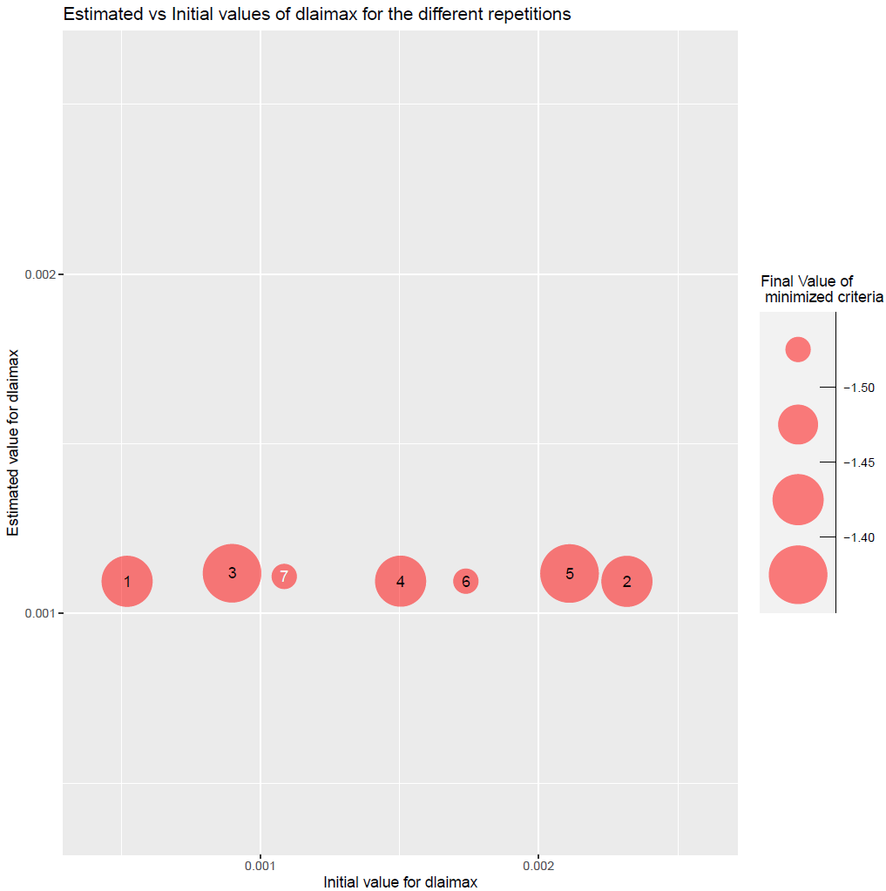
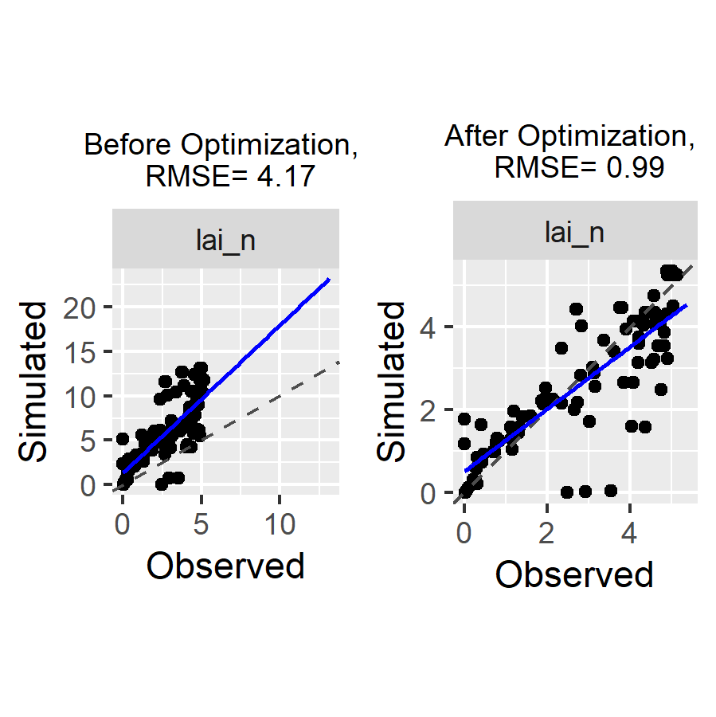

```{r setup, eval=TRUE, include=FALSE}
# Global options
path_to_JavaStics <- params$path_to_JavaStics
```


## Study Case

This document presents an example of a simultaneous estimation of one specific and one varietal parameter on a multi-varietal dataset using the Stics model, while a simpler introductory example is presented in this [vignette](https://sticsrpacks.github.io/CroptimizR/articles/Parameter_estimation_simple_case.html) (you should look at it first).

Data comes from a maize crop experiment (see description in Wallach et al., 2011). In this example, 8 situations (USMs in Stics language) will be used for the parameter estimation. This test case correspond to case 1c in (Wallach et al., 2011).

The parameter estimation is performed using the Nelder-Mead simplex method implemented in the nloptr package.


## Initialisation step

This part is not shown here, it is the same as this of the [introductory example](https://sticsrpacks.github.io/CroptimizR/articles/Parameter_estimation_simple_case.html).

```{r setup_install_per_package, eval=params$eval_auto_test,  echo=FALSE}
# Install and load the needed libraries
# This one is adapted for manual or test cases (one can first install the
# version of the libraries we want to test)
library(SticsOnR)
library(SticsRFiles)
library(CroptimizR)
library(CroPlotR)
library(ggplot2)
library(gridExtra)
```


```{r setup_initializations, eval=params$eval_auto_test, message=FALSE, results=FALSE, warning=FALSE,  echo=FALSE}

# DEFINE THE PATH TO YOUR LOCALLY INSTALLED VERSION OF JAVASTICS
javastics_path <- path_to_JavaStics

# Download the example USMs and define the path to the JavaStics workspace
# (JavaStics XML input files):
data_dir <- file.path(
  SticsRFiles::download_data(
    example_dirs = "study_case_1",
    stics_version = "V9.0"
  )
)
javastics_workspace_path <- file.path(data_dir, "XmlFiles")
stics_inputs_path <- file.path(data_dir, "TxtFiles")

# Generate Stics input files from JavaStics input files
dir.create(stics_inputs_path, showWarnings = FALSE)
gen_usms_xml2txt(
  javastics = javastics_path,
  workspace = javastics_workspace_path,
  out_dir = stics_inputs_path, 
  verbose = TRUE
)
```


## Read and select the corresponding observations

In this example, observed LAI are used for all USMs for which there is an observation file in `javastics_workspace_path` folder.


```{r eval=params$eval_auto_test, message=FALSE, warning=FALSE}
# Read observation files
obs_list <- get_obs(javastics_workspace_path)
obs_list <- 
  filter_obs(
    obs_list, 
    var = c("lai_n"), 
    include = TRUE
  )
```


## Set information on the parameters to estimate

**`param_info` allows handling specific / varietal parameters** (dlaimax vs durvieF parameters in this example): dlaimax is defined to take the same value for all situations, whereas durvieF is defined in such a way that it may take one value for situations `c("bo96iN+", "lu96iN+", "lu96iN6", "lu97iN+")`, that correspond to a given variety, and another for situations `c("bou99t3", "bou00t3", "bou99t1", "bou00t1")`, that correspond to another variety, `sit_list` being in this case a list of size 2 (see code below).
Please note that bounds can take different values for the different groups of situations (lb and ub are vectors of size 2 for durvieF).


```{r eval=params$eval_auto_test, message=FALSE, warning=FALSE}
param_info <- list()
param_info$dlaimax <- 
  list(
    sit_list = 
      list(
        c(
          "bou99t3", 
          "bou00t3", 
          "bou99t1",
          "bou00t1", 
          "bo96iN+",
          "lu96iN+",
          "lu96iN6", 
          "lu97iN+"
        )
      ),
    lb = 0.0005, 
    ub = 0.0025
  )

param_info$durvieF <- list(
  sit_list = 
    list(
      c("bo96iN+", "lu96iN+", "lu96iN6","lu97iN+"),
      c("bou99t3", "bou00t3", "bou99t1","bou00t1")
    ),
  lb = c(50, 100), 
  ub = c(400, 450)
)
```


## Set options for the model

```{r eval=params$eval_auto_test, message=FALSE, warning=FALSE}

model_options <- 
  stics_wrapper_options(
    javastics = javastics_path,
    workspace = stics_inputs_path,
    parallel = TRUE
  )
```


## Set options for the parameter estimation method

```{r eval=params$eval_auto_test, message=FALSE, warning=FALSE}

optim_options <- list()
optim_options$nb_rep <- 7 # Number of repetitions of the minimization
# (each time starting with different initial
# values for the estimated parameters)
optim_options$maxeval <- 1000 # Maximum number of evaluations of the
# minimized criteria
optim_options$xtol_rel <- 1e-04 # Tolerance criterion between two iterations
# (threshold for the relative difference of
# parameter values between the 2 previous
# iterations)
optim_options$out_dir <- data_dir # path where to store the results
# (graph and Rdata)
optim_options$ranseed <- 1234 # random seed
```


## Run the optimization

The optimization is performed here with the Nelder-Mead simplex method and `crit_log_cwss` criterion that are the default values in the `estim_param` function for the `optim_method` and `crit_function` arguments.


```{r eval=params$eval_auto_test, results='hide', message=FALSE, warning=FALSE}
res <- estim_param(
  obs_list = obs_list,
  model_function = stics_wrapper,
  model_options = model_options,
  optim_options = optim_options,
  param_info = param_info
)
```

The estimated values of the parameters are the following:

```{r eval=FALSE, echo=TRUE}
res$final_values
```

```{r echo=FALSE, eval=params$eval_auto_vignette, warning=FALSE}
load(file.path("ResultsSpecificVarietal", "optim_results.Rdata"))
res$final_values
```

The EstimatedVSinit.pdf file contains the following figures:


```{r eval=params$eval_auto_vignette, echo=FALSE, out.width = '45%'}

knitr::include_graphics("ResultsSpecificVarietal/estimInit_durvieF_var1.PNG")
knitr::include_graphics("ResultsSpecificVarietal/estimInit_durvieF_var2.PNG")
```


Figure 1: plots of estimated vs initial values of parameters dlaimax and durvieF (estimated for both varieties).


## Compare simulations and observations before and after optimization

A piece of code to run the model with the values of the parameters before and after the optimization and to create a couple of plots using the [CroPlotR](https://github.com/SticsRPacks/CroPlotR) package to check if the calibration reduced the difference between simulations and observations:

```{r eval=params$eval_manual_vignette, message=FALSE, warning=FALSE}

# Run the model without and with forcing the optimized values of the parameters
sim_before_optim <- stics_wrapper(model_options = model_options)
sim_after_optim <- stics_wrapper(
  param_values = res$final_values,
  model_options = model_options
)

stats <- summary(sim_before_optim$sim_list, obs = obs_list)
p <- plot(
  sim_before_optim$sim_list, 
  obs = obs_list, 
  type = "scatter",
  all_situations = TRUE
)

p1 <- 
  p[[1]] + 
  labs(title = 
         paste(
           "Before Optimization, \n RMSE=", 
           round(stats$RMSE, digits = 2)
         )
  ) +
  theme(plot.title = element_text(size = 9, hjust = 0.5))

stats <- summary(sim_after_optim$sim_list, obs = obs_list)
p <- 
  plot(
    sim_after_optim$sim_list, 
    obs = obs_list, 
    type = "scatter",
    all_situations = TRUE
  )

p2 <- 
  p[[1]] + 
  labs(title = 
         paste(
           "After Optimization, \n RMSE=",
           round(stats$RMSE, digits = 2)
         )
  ) +
  theme(plot.title = element_text(size = 9, hjust = 0.5))

p <- grid.arrange(grobs = list(p1, p2), nrow = 1, ncol = 2)
# Save the graph
ggsave(
  file.path(
    optim_options$out_dir,
    paste0("sim_obs", ".png")
  ), 
  plot = p
)

```

This gives:


```{r eval=params$eval_auto_vignette, echo=FALSE, message=FALSE, out.width = '80%', fig.cap="Figure 2: plots of simulated vs observed LAI before and after optimization. The gap between simulated and observed values has been drastically reduced: the minimizer has done its job!"}

```


```{r move_results, eval=params$eval_manual_vignette, include=FALSE}
# Move the files produced since the temp. folder is removed after Rmd execution
file.copy(
  file.path(optim_options$out_dir, "EstimatedVSinit.pdf"),
  params$result_path, 
  overwrite = TRUE
)
file.copy(
  file.path(optim_options$out_dir, "optim_results.Rdata"),
  params$result_path, 
  overwrite = TRUE
)
file.copy(
  file.path(optim_options$out_dir, "sim_obs.png"),
  params$result_path, 
  overwrite = TRUE
)
```
