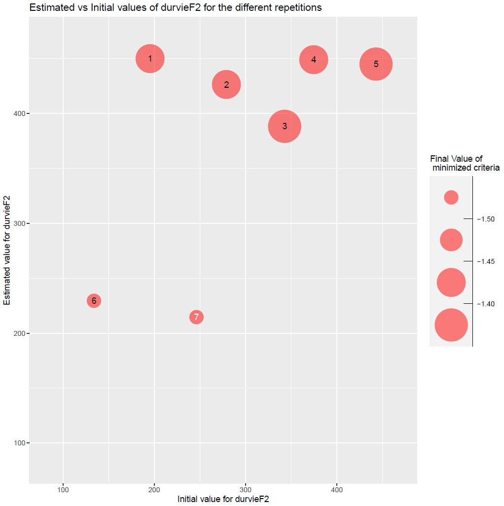

```{r setup, eval=TRUE, include=FALSE}
# Global options
knitr::opts_chunk$set(eval = params$eval_rmd)
```

## Study Case

This document presents an example of a simultaneous estimation of one specific and one varietal parameter using the stics model, while a simpler introductory example is presented in this [vignette](https://sticsrpacks.github.io/SticsOptimizR/articles/Parameter_estimation_simple_case.html) (you should look at it first).

Data comes from a maize crop experiment (see description in Wallach et al., 2011). In this example, 8 situations (USMs in Stics language) will be used for the parameter estimation. This test case correspond to case 1c in (Wallach et al., 2011).

The parameter estimation is performed using the Nelder-Meade simplex method implemented in the nloptr package.


## Initialisation step

This part is not shown here, it is the same as this of the [introductory example](https://sticsrpacks.github.io/SticsOptimizR/articles/Parameter_estimation_simple_case.html). 

```{r setup and initializations,  echo=FALSE, message=FALSE, results=FALSE, warning=FALSE}
knitr::opts_chunk$set(echo = TRUE)

# Install and load the needed libraries
if(!require("SticsRFiles")){
  devtools::install_github("SticsRPacks/SticsRFiles")
  library("SticsRFiles")
}
if(!require("SticsOnR")){
  devtools::install_github("SticsRPacks/SticsOnR")
  library("SticsOnR")
}
if(!require("SticsOptimizR")){
  devtools::install_github("SticsRPacks/SticsOptimizR")
  library("SticsOptimizR")
}
if(!require("dplyr")){
  install.packages("dplyr",repos="http://cran.irsn.fr")
  library("dplyr")
}
if(!require("nloptr")){
  install.packages("nloptr",repos="http://cran.irsn.fr")
  library("nloptr")
}
if(!require("DiceDesign")){
  install.packages("DiceDesign",repos="http://cran.irsn.fr")
  library("DiceDesign")
}
if(!require("doParallel")){
  install.packages("doParallel",repos="http://cran.irsn.fr")
  library("doParallel")
}
if(!require("hydroGOF")){
  install.packages("hydroGOF",repos="http://cran.irsn.fr")
  library("hydroGOF")
}
if(!require("ggplot2")){
  install.packages("ggplot2",repos="http://cran.irsn.fr")
  library("ggplot2")
}
if(!require("gridExtra")){
  install.packages("gridExtra",repos="http://cran.irsn.fr")
  library("gridExtra")
}


# Download the example USMs:
data_dir= normalizePath(tempdir(), winslash = "/", mustWork = FALSE)
data_dir_zip= normalizePath(file.path(data_dir,"master.zip"), winslash = "/", mustWork = FALSE)
download.file("https://github.com/SticsRPacks/data/archive/master.zip", data_dir_zip)
unzip(data_dir_zip, exdir = data_dir)
unlink(data_dir_zip)
data_dir= file.path(normalizePath(list.dirs(data_dir)[2], winslash = "/"),"study_case_1","V9.0")
# NB: all examples are now in data_dir

# Define the path to the local version of JavaStics 
javastics_path=file.path(getwd(),"JavaSTICS-1.41-stics-9.0")
stics_path=file.path(javastics_path,"bin/stics_modulo.exe")
```

## Read and select the corresponding observations

In this example, observed LAI are used.

```{r message=FALSE, warning=FALSE}
# Read observation files
obs_list=read_obs_to_list(file.path(data_dir,"XmlFiles"))
obs_list=lapply(obs_list,"[",c("Date","lai_n"))
```

## Set prior information on the parameters to estimate

prior_information allows handling specific / varietal parameters (dlaimax vs durvieF parameters in this example): dlaimax is defined to take the same value for all situations, whereas durvieF is defined in such a way that it may take one value for situations c("bo96iN+", "lu96iN+", "lu96iN6", "lu97iN+"), that correspond to a given variety, and another for situations c("bou99t3", "bou00t3", "bou99t1", "bou00t1"), that correspond to another variety, sit_list being a list of size 2.
Please note that bounds can take different values for the different groups of situations (lb and ub are vectors of size 2 for durvieF).

```{r message=FALSE, warning=FALSE}
prior_information=list()
prior_information$dlaimax=list(sit_list=list(c("bou99t3", "bou00t3", "bou99t1", "bou00t1", "bo96iN+", "lu96iN+", "lu96iN6", "lu97iN+")),lb=0.0005,ub=0.0025)
prior_information$durvieF=list(sit_list=list(c("bo96iN+", "lu96iN+", "lu96iN6", "lu97iN+"), c("bou99t3", "bou00t3", "bou99t1", "bou00t1")),lb=c(50,100),ub=c(400,450))
```

## Set options for the parameter estimation method

```{r message=FALSE, warning=FALSE}
optim_options=list() 
optim_options$nb_rep <- 2 # 10 # Number of repetitions of the minimization 
                          # (each time starting with different initial
                          # values for the estimated parameters) 
optim_options$maxeval <- 2 # 1000 # Maximum number of evaluations of the 
                            # minimized criteria 
optim_options$xtol_rel <- 1e-04 # Tolerance criterion between two iterations
                                # (threshold for the relative difference of
                                # parameter values between the 2 previous 
                                # iterations)
optim_options$path_results <- getwd() # path where to store the results (graph and Rdata)
optim_options$ranseed <- 1234 # random seed  
```

## Run the optimization

```{r results='hide', message=FALSE, warning=FALSE}
# Set the model options (see '? stics_wrapper_options' for details)
model_options=stics_wrapper_options(stics_path,data_dir) 

# Run the optimization
optim_results=main_optim(obs_list=obs_list,
                            model_function=stics_wrapper,
                            model_options=model_options,
                            optim_options=optim_options,
                            prior_information=prior_information)

```

The results printed in output on the R console are the following:
```{r eval=FALSE, echo=TRUE}
## [1] "Estimated value for dlaimax :  0.00106741475850639"
## [1] "Estimated value for durvieF :  391.070248404957"
## [1] "Estimated value for durvieF :  214.674867188563"
## [1] "Minimum value of the criterion : 1.68619365090367e+35"
```

Complementary graphs and data are stored in the optim_options$path_results folder. Among them, the EstimatedVSinit.pdf file containing the following figures: 

```{r eval=TRUE, echo=FALSE, image_grobs, fig.show = "hold", out.width = "45%", fig.align = "default"}

knitr::include_graphics("ResultsSpecificVarietal/estimInit_dlaimax.PNG")




```

Figure 1: plots of estimated vs initial values of parameters dlaimax and durvieF (estimated for both varieties).


## Compare simulations and observations before and after optimization

```{r message=FALSE, warning=FALSE}
# Run the model without and with forcing the optimized values of the parameters
sim_before_optim=stics_wrapper(model_options=model_options)

sim_after_optim=stics_wrapper(param_values=optim_results$final_values,
                              model_options=model_options)
  
# transform into data.frame and intersect for using ggplot2
sim_before_df = bind_rows(sim_before_optim$sim_list,.id = 'Situation')
sim_after_df = bind_rows(sim_after_optim$sim_list,.id = 'Situation')
obs_df = bind_rows(obs_list,.id = 'Situation')
sim_before_df = rename(sim_before_df,LAI_sim=lai_n)
sim_after_df = rename(sim_after_df,LAI_sim=lai_n)
obs_df = rename(obs_df,LAI_obs=lai_n)
sim_before_obs_df = merge.data.frame(sim_before_df,obs_df,by = c('Situation','Date'), all.x = TRUE)
sim_after_obs_df = merge.data.frame(sim_after_df,obs_df,by = c('Situation','Date'), all.x = TRUE)

# Compute RMSE
rmse_before = rmse(sim_before_obs_df$LAI_obs,sim_before_obs_df$LAI_sim)
rmse_after = rmse(sim_after_obs_df$LAI_obs,sim_after_obs_df$LAI_sim)

# Plot the graphs
maxLAI=max(c(sim_before_obs_df$LAI_obs,sim_before_obs_df$LAI_sim,sim_after_obs_df$LAI_sim,na.rm=TRUE),na.rm=TRUE)

p1=ggplot(sim_before_obs_df, aes(x = LAI_obs, y = LAI_sim)) + 
  geom_point(shape=21, size = 3, color = 'blue',
             fill="white",alpha = 0.8,stroke = 1) +
  theme(text = element_text(size=16)) + 
  theme(aspect.ratio=1) +
  labs(x = "Observed LAI", y = "Simulated LAI") +
  geom_abline(intercept = 0, slope = 1, size = 0.5, color = "blue") +
  xlim(0,maxLAI) +  ylim(0,maxLAI) +
  ggtitle(paste("Before optimization \n RMSE=",round(rmse_before,2))) +
  theme(plot.title = element_text(hjust = 0.5))

p2=ggplot(sim_after_obs_df, aes(x = LAI_obs, y = LAI_sim)) + 
  geom_point(shape=21, size = 3, color = 'blue',
             fill="white",alpha = 0.8,stroke = 1) +
  theme(text = element_text(size=16)) + 
  theme(aspect.ratio=1) +
  labs(x = "Observed LAI", y = "Simulated LAI") +
  geom_abline(intercept = 0, slope = 1, size = 0.5, color = "blue") +
  xlim(0,maxLAI+0.1*maxLAI) +  ylim(0,maxLAI+0.1*maxLAI) +
  ggtitle(paste("After optimization \n RMSE=",round(rmse_after,2))) +
  theme(plot.title = element_text(hjust = 0.5))

grid.arrange(grobs=list(p1,p2), nrow=1, ncol=2)

# Save the graph
ggsave(file.path(optim_options$path_results,
                 paste0("sim_obs",".png")))

  
```
