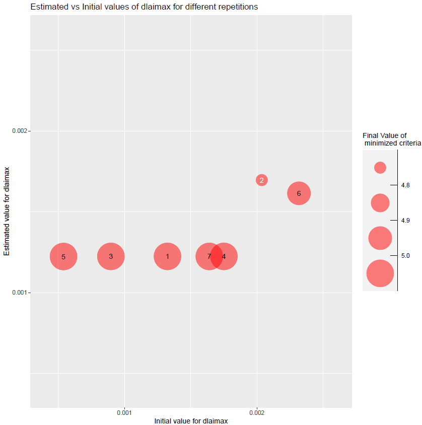
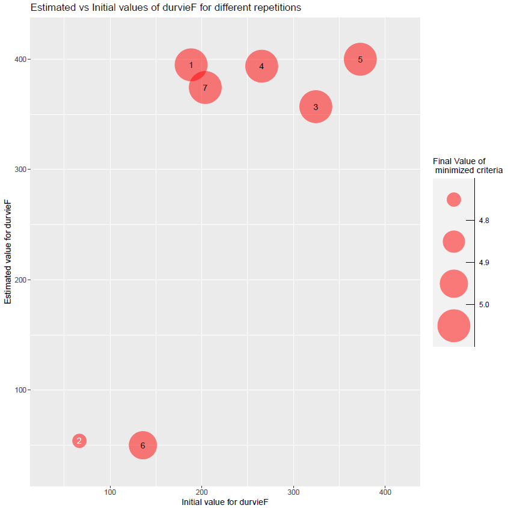
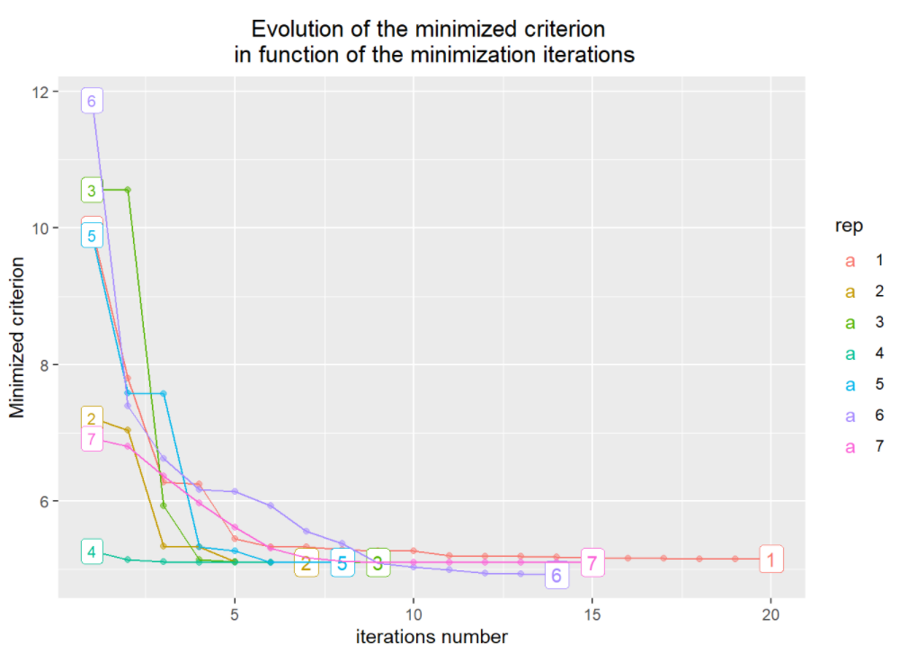
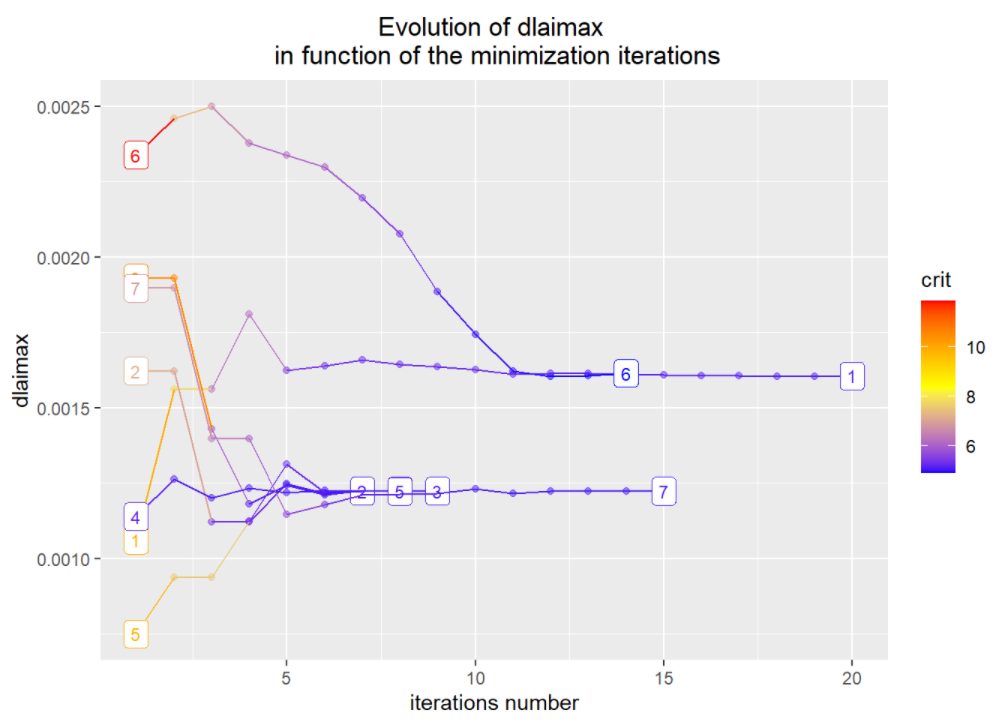
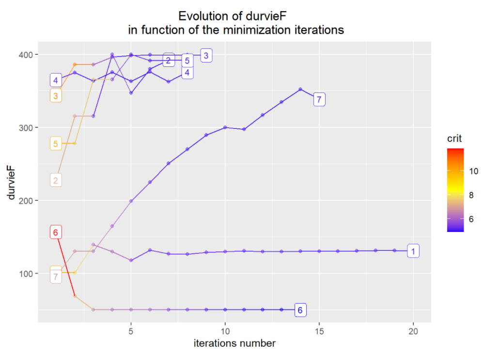
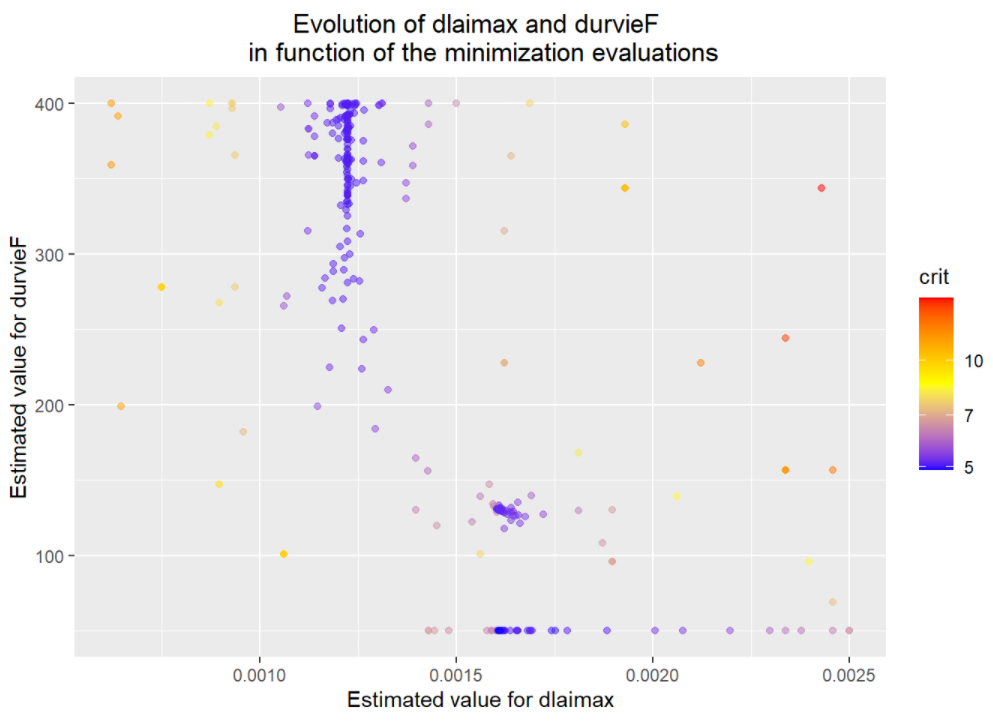
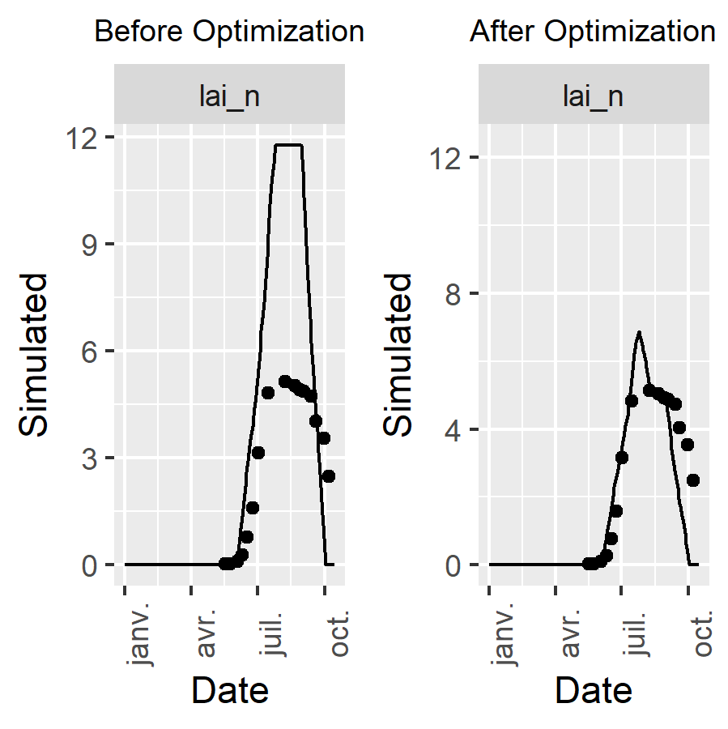

```{r setup, eval=TRUE, include=FALSE}
# Global options
path_to_JavaStics <- params$path_to_JavaStics
```

## Introduction

This document presents a simple example of parameter estimation using CroptimizR on a complex crop model. 

For more advanced use cases, the following vignettes are available:  
- [Simultaneous estimation of specific and varietal plant parameters](https://SticsRPacks.github.io/CroptimizR/articles/Parameter_estimation_Specific_and_Varietal.html) using a multi-varietal dataset.  
- [Parameter selection procedure](https://SticsRPacks.github.io/CroptimizR/articles/Parameter_selection.html) illustrating how to choose which parameters to estimate.  
- [AgMIP Calibration Protocol](https://SticsRPacks.github.io/CroptimizR/articles/AgMIP_Calibration_Protocol.html) demonstrating the application of the AgMIP calibration workflow.  
- [Bayesian parameter estimation](https://SticsRPacks.github.io/CroptimizR/articles/Parameter_estimation_DREAM.html) using the DREAM-zs algorithm.  

## Study Case

This example uses the STICS crop model. However, CroptimizR can be applied to any crop model, provided that a suitable wrapper is available. Guidelines and examples for implementing wrappers are provided in the [Designing a model wrapper vignette](https://sticsrpacks.github.io/CroptimizR/articles/Designing_a_model_wrapper.html).

Note that a similar example using the ApsimX crop model is available in another [vignette](https://sticsrpacks.github.io/CroptimizR/articles/ApsimX_parameter_estimation_simple_case.html).

Wrappers already exist for several models (e.g., STICS, APSIM, SiriusQuality2, DSSAT, and others). For more details, see the [package README](https://sticsrpacks.github.io/CroptimizR/) or contact the authors.

The dataset used in this example comes from a maize crop experiment (see Wallach et al., 2011). It involves a single environment, a single observed variable, and two estimated parameters, just to illustrate how to use the package.

Parameter estimation is performed here using the Nelder-Mead simplex method implemented in the R package `nloptr`.

## Initialisation step

```{r setup_install_per_package, eval=params$eval_auto_test, include=FALSE}
# Install and load the needed libraries
# This one is adapted for manual or test cases (one can first install the
# version of the libraries we want to test)
library(SticsOnR)
library(SticsRFiles)
library(CroptimizR)
library(CroPlotR)
library(ggplot2)
library(gridExtra)
library(tidyr)
```

```{r setup_install, eval=FALSE, message=FALSE, results=FALSE, warning=FALSE}
# Install and load the needed libraries
if (!require("SticsRPacks")) {
  devtools::install_github("SticsRPacks/SticsRPacks")
  library("SticsRPacks")
}
```

```{r setup_initializations, eval=params$eval_auto_test, message=FALSE, results=FALSE, warning=FALSE}
# DEFINE THE PATH TO YOUR LOCALLY INSTALLED VERSION OF JAVASTICS
javastics_path <- path_to_JavaStics

# Download the example USMs and define the path to the JavaStics workspace
# (JavaStics XML input files):
data_dir <- file.path(
  SticsRFiles::download_data(
    example_dirs = "study_case_1",
    stics_version = "V9.0"
  )
)

javastics_workspace_path <- file.path(data_dir, "XmlFiles")
```


## Generate Stics input files from JavaStics input files

The Stics wrapper function used in CroptimizR works on Stics input files (text formatted files new_travail.usm,
climat.txt, ...) stored per USMs in different directories (which names must be the USM names).
`stics_inputs_path` is here the path of the directory that will contain these USMs folders.

If you start from xml formatted input files (JavaStics format: usms.xml, sols.xml, ...)
the following lines allow generating txt files from xml files.
In this example, xml files are stored in `javastics_workspace_path` and the Stics input files
(test format) will be stored in `stics_inputs_path=file.path(data_dir,"TxtFiles")`


```{r gen_dirs, eval=params$eval_auto_test, results='hide', message=FALSE, warning=FALSE}
stics_inputs_path <- file.path(data_dir, "TxtFiles")
dir.create(stics_inputs_path, showWarnings = FALSE)

gen_usms_xml2txt(
  javastics = javastics_path,
  workspace = javastics_workspace_path,
  out_dir = stics_inputs_path,
  verbose = TRUE
)
```


## Run the model before optimization for a prior evaluation

Here model parameters values are read in the model input files.


```{r eval=params$eval_auto_test, results='hide', message=FALSE, warning=FALSE}
# Set the model options (see '? stics_wrapper_options' for details)
model_options <-
  stics_wrapper_options(
    javastics = javastics_path,
    workspace = stics_inputs_path,
    parallel = FALSE
  )

# Run the model on all situations found in stics_inputs_path
sim_before_optim <- stics_wrapper(model_options = model_options)
```


## Read and select the observations for the parameter estimation

For Stics, observation files must for the moment have exactly the same names as the corresponding USMs and be stored in a unique folder to be read by the get_obs function. This will be improved in next versions.

In this example, we only keep observations for situation (i.e. USM for Stics) `sit_name` and variable `var_name`.

**`obs_list` defines the list of situations, variables and dates that will be used to estimate the parameters. Use the function `filter_obs` (see `? filter_obs`) for removing situations, variables and/or dates from an observation list.**

In variables and parameters names, "(\*)" must be replaced by "_\*" to be handled by R (e.g. lai(n) is denoted here lai_n).


```{r eval=params$eval_auto_test, message=FALSE, warning=FALSE}
sit_name <- "bo96iN+" # can be a vector of situation names if you want to
# consider several, e.g. c("bo96iN+","bou00t1")
var_name <- "lai_n" # can be a vector of variable names if you want to
# consider several, e.g. c("lai_n","masec_n")
obs_list <- get_obs(javastics_workspace_path, usm = sit_name)
obs_list <- filter_obs(obs_list, var = var_name, include = TRUE)
```


## Set information on the parameters to estimate

**`param_info` must contain information about the parameters that will be estimated in the parameter estimation process from the situations, variables and dates defined in `obs_list`**.

It must include the definition of their upper and lower bounds (-Inf and Inf can be used). This will determine the list of estimated parameters.

All the numerical parameters which values can be provided to the model through its R wrapper can be estimated using the provided parameter estimation methods (although it may not work well for integer parameters).

Initial values for the minimization can also be provided in `param_info` (see `? estim_param`).


```{r eval=params$eval_auto_test, message=FALSE, warning=FALSE}
# 2 parameters here: dlaimax and durvieF, of bounds [0.0005,0.0025] and [50,400]
param_info <- list(
  lb = c(dlaimax = 0.0005, durvieF = 50),
  ub = c(dlaimax = 0.0025, durvieF = 400)
)
```


## Set options for the parameter estimation method

`optim_options` must contain the options of the parameter estimation method.
Here we defined a few important options for the simplex method of the nloptr package (default method in estim_param).
To see the full set of options available for the simplex method, type `? nl.opts`

The number of repetitions is advised to be set to at least 5, while 10 is a reasonable maximum value.
`maxeval` should be used to stop the minimization only if results have to be produced within a given duration, otherwise set it to a high value so that the minimization stops when the criterion based on `xtol_rel` is satisfied.


```{r eval=params$eval_auto_test, message=FALSE, warning=FALSE}
optim_options <- list()
optim_options$nb_rep <- 7 # Number of repetitions of the minimization
# (each time starting with different initial
# values for the estimated parameters)
optim_options$maxeval <- 500 # Maximum number of evaluations of the
# minimized criteria
optim_options$xtol_rel <- 1e-03 # Tolerance criterion between two iterations
# (threshold for the relative difference of
# parameter values between the 2 previous
# iterations)
optim_options$ranseed <- 1234 # set random seed so that each execution give the
# same results
# If you want randomization, don't set it.
```


## Run the optimization

The Nelder-Mead simplex is the default method => no need to set the
optim_method argument if you want to use it. The list of available methods is detailed [here](https://sticsrpacks.github.io/CroptimizR/articles/Available_parameter_estimation_algorithms.html).
Same for crit_function: a value is set by default (`crit_log_cwss`, see `? crit_log_cwss` or [here](https://sticsrpacks.github.io/CroptimizR/reference/ls_criteria.html) for more details and list of available criteria). Others will be proposed in next versions of CroptimizR. The user can implement and give in argument its own criterion (see inputs and outputs required in the `crit_log_cwss` function).


```{r eval=params$eval_auto_test, message=FALSE, warning=FALSE}
res <- estim_param(
  obs_list = obs_list,
  model_function = stics_wrapper,
  model_options = model_options,
  optim_options = optim_options,
  param_info = param_info,
  out_dir = data_dir # path where to store the results
)
```

The `estim_param` function returns a list which is also stored in the optim_results.Rdata file of the `out_dir` folder. 

This list contains different information depending on the method used. For the Nelder-Mead simplex method it includes among others:

* the final values estimated for the parameters

```{r eval=FALSE, echo=TRUE}
res$final_values
```

```{r echo=FALSE, eval=params$eval_auto_vignette, warning=FALSE}
load(file.path("ResultsSimpleCase", "optim_results.Rdata"))
res$final_values
```

* the initial and final values of the estimated parameters for each repetition of the minimization:

```{r eval=FALSE, echo=TRUE}
res$init_values
```

```{r echo=FALSE, eval=params$eval_auto_vignette, warning=FALSE}
res$init_values
```

```{r eval=FALSE, echo=TRUE}
res$est_values
```

```{r echo=FALSE, eval=params$eval_auto_vignette, warning=FALSE}
res$est_values
```

* the minimum value of the criterion among all repetitions and for all repetitions:

```{r eval=FALSE, echo=TRUE}
res$min_crit_value
```

```{r echo=FALSE, eval=params$eval_auto_vignette, warning=FALSE}
res$min_crit_value
```


```{r eval=FALSE, echo=TRUE}
res$crit_values
```

```{r echo=FALSE, eval=params$eval_auto_vignette, warning=FALSE}
res$crit_values
```

* the plots automatically generated (see their description here-after) in ggplot format (=> can be modified using standard ggplot commands)

* elapsed time measurements (total time, total time of model simulations, average time of model simulations)

* the list of values of the parameters and of the criterion for each evaluation during the minimization (`params_and_crit`), if `info_level>=1`

* the `nlo` variable, a list returned by the nloptr function that contains detailed information on the results of the minimization for each repetition.

`nlo` is a list of size the number of repetitions. Each element stores many information about the corresponding minimization,
including the number of iterations performed (field `iterations`) and a message indicating why the minimization stopped (field `message`).

Let's print it for the repetition that leads to the minimum value of the criterion over all repetitions:

```{r eval=FALSE, echo=TRUE}
res$nlo[[res$ind_min_crit]]
```

```{r echo=FALSE, eval=params$eval_auto_vignette, warning=FALSE}
load(file.path("ResultsSimpleCase", "optim_results.Rdata"))
print(res$nlo[[res$ind_min_crit]])
```

This data is also stored in the `out_dir` folder (file optim_results.Rdata) along with a set of pdf files:

* the EstimatedVSinit.pdf file contains the following figures:


```{r eval=params$eval_auto_vignette, echo=FALSE, out.width = '45%'}



```


Figure 1: plots of estimated vs initial values of parameters dlaimax and durvieF. Numbers represent the repetition number of the minimization and the size of the bubbles the final value of the minimized criterion. The number in white, `r res$ind_min_crit` in this case, is the minimization that leads to the minimal value of the criterion among all repetitions. In this case, the minimizations converge towards different values for the parameters, which indicates the presence of local minima. Values of durvieF are close to the bounds. In realistic calibration cases with many observed situations / variables / dates this may indicate the presence of biases in the observation values or in the model output values simulated (this simple case with only one situation does not allow to derive such conclusion).

* the ValuesVSit.pdf file contains:

```{r eval=params$eval_auto_vignette, echo=FALSE, out.width = '45%', fig.show = "hold", fig.align="default"}





```

Figure 2: The top left figure displays the evolution of the minimized criterion value in function of the iterations of the minimization. Colors and labels represent the repetition number. The top right figure displays the evolution of the value of the dlaimax parameter in function of the iterations of the minimization. Labels represent the repetition number and colors the value of the minimized criterion. The figure at the bottom is the same but for the durvieF parameter.

* the ValuesVSit_2D.pdf file contains:

```{r eval=params$eval_auto_vignette, echo=FALSE, message=FALSE, warning=FALSE, out.width = '60%', fig.cap="Figure 3: This figure displays all the values proposed by the minimizer for the durvieF (Y axis) and dlaimax (X-axis) parameters and the associated values of the minimized criterion (dot colors)."}

```

## Run the model after optimization

We run here the Stics model using the estimated values of the parameters.
In this case, the `param_values` argument of the stics_wrapper function is thus set so that estimated values of the parameters overwrite the values defined in the model input files.


```{r eval=params$eval_manual_vignette, message=FALSE, warning=FALSE}
sim_after_optim <- stics_wrapper(
  param_values = res$final_values,
  model_options = model_options
)
```


## Plot the results

Here we use the [CroPlotR](https://github.com/SticsRPacks/CroPlotR) package for comparing simulations and observations. As CroptimizR, CroPlotR can be used with any crop model.

```{r eval=params$eval_manual_vignette, warning=FALSE, message=FALSE}
p <- plot(
  sim_before_optim$sim_list,
  obs = obs_list,
  select_dyn = c("common")
)

p1 <-
  p[[sit_name]] +
  labs(title = "Before Optimization") +
  theme(plot.title = element_text(size = 9, hjust = 0.5))

p <-
  plot(
    sim_after_optim$sim_list,
    obs = obs_list,
    select_dyn = c("common")
  )

p2 <- p[[sit_name]] +
  labs(title = "After Optimization") +
  ylim(
    NA,
    ggplot_build(p1)$layout$panel_params[[1]]$y.range[2]
  ) +
  theme(plot.title = element_text(size = 9, hjust = 0.5))

p <- grid.arrange(
  grobs = list(p1, p2),
  nrow = 1,
  ncol = 2,
  widths = c(5, 5)
)
# Save the graph
ggsave(
  file.path(
    data_dir,
    paste0("sim_obs_plots", ".png")
  ),
  plot = p
)
```


This gives:


```{r eval=params$eval_auto_vignette, echo=FALSE, message=FALSE, warning=FALSE, out.width = '60%', fig.cap="Figure 4: plots of simulated and observed target variable before and after optimization. The gap between simulated and observed values has been drastically reduced: the minimizer has done its job!"}

```


```{r move_results, eval=params$eval_manual_vignette, include=FALSE}
# Move the files produced since the temp. folder is removed after Rmd execution
file.copy(
  file.path(data_dir, "EstimatedVSinit.pdf"),
  params$result_path,
  overwrite = TRUE
)
file.copy(
  file.path(data_dir, "optim_results.Rdata"),
  params$result_path,
  overwrite = TRUE
)
file.copy(
  file.path(data_dir, "sim_obs_plots.png"),
  params$result_path,
  overwrite = TRUE
)
```
